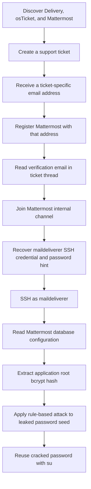
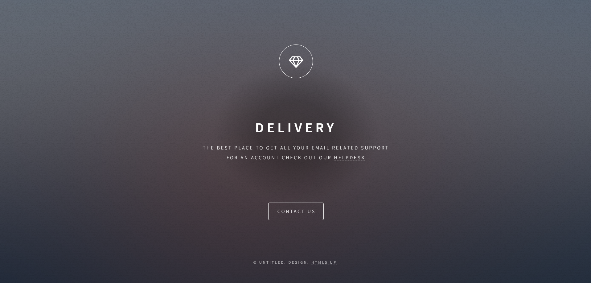
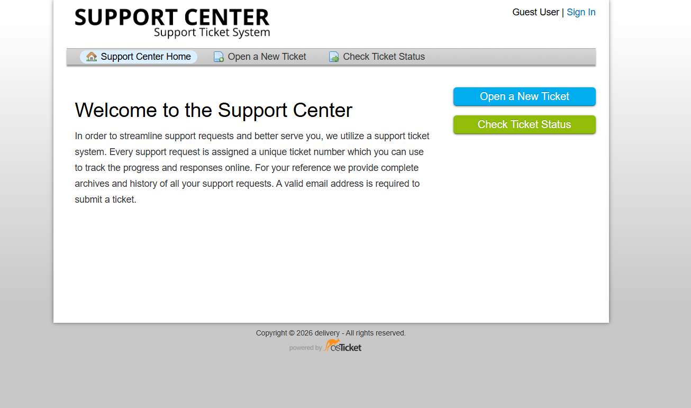
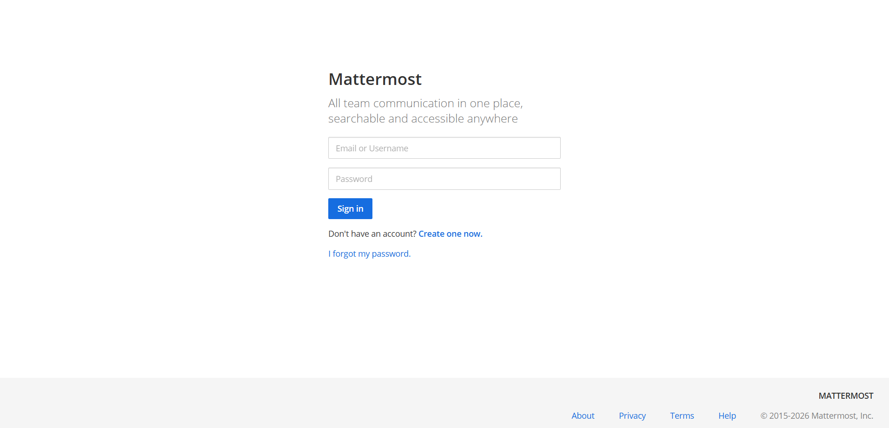
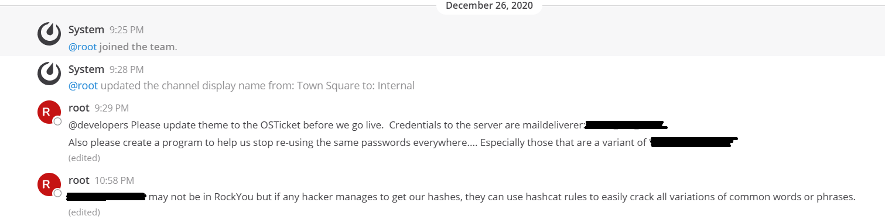

# Delivery - Hack The Box Write-Up

## Machine Information

| Field | Value |
| --- | --- |
| Machine | Delivery |
| Platform | Hack The Box |
| Status | Retired |
| Operating system | Debian 10 |
| Difficulty | Easy |
| Primary services | SSH, HTTP, osTicket, Mattermost |
| Main techniques | Virtual-host discovery, ticket-email trust abuse, credential disclosure, SSH, configuration-file secrets, MySQL enumeration, rule-based bcrypt cracking, password reuse |

## Executive Summary

I began by identifying nginx on TCP `80` and Mattermost on TCP `8065`. The main Delivery page linked me to an osTicket helpdesk on `helpdesk.delivery.htb`. When I created a support request, the helpdesk assigned the ticket a unique `<TICKET_ID>@delivery.htb` address and displayed messages received by that address inside the ticket thread.

I used that ticket address to register a Mattermost account. Mattermost sent its email-verification link to the address, while osTicket accepted the message and exposed it in the ticket thread I could already view. Following the link verified my Mattermost account without control of a real corporate mailbox.

Inside the Mattermost team, I found an internal-channel message containing SSH credentials for `maildeliverer` and a separate hint describing the organization's password-reuse pattern. The credential gave me a low-privileged SSH session.

On the host, I found Mattermost's world-readable `config.json` and recovered credentials for its local MySQL database. The `Users` table contained a bcrypt hash for a Mattermost application account named `root`. I combined the leaked password-pattern hint with Hashcat's `best66.rule` transformations and recovered the password. Finally, `su - root` accepted the same value, proving that the application password had been reused by the Linux root account.



## Placeholder and Evidence Conventions

| Placeholder                | Meaning                                                          |
| -------------------------- | ---------------------------------------------------------------- |
| `<TARGET_IP>`              | Current IP address assigned to Delivery                          |
| `<TICKET_ID>`              | Redacted support-ticket number                                   |
| `<TICKET_EMAIL>`           | Redacted ticket-specific `@delivery.htb` address                 |
| `<VERIFICATION_TOKEN>`     | Redacted Mattermost email-verification token                     |
| `<MAILDELIVERER_PASSWORD>` | Redacted SSH password disclosed in Mattermost                    |
| `<DB_PASSWORD>`            | Redacted Mattermost MySQL password                               |
| `<PASSWORD_SEED>`          | Redacted phrase disclosed as the organization's password pattern |
| `<ROOT_BCRYPT_HASH>`       | Redacted Mattermost bcrypt hash                                  |
| `<ROOT_PASSWORD>`          | Redacted password recovered through the rule attack              |
| `<REDACTED>`               | Other sensitive material removed from output                     |

I do not include either flag value. My notes prove SSH access as `maildeliverer` and an interactive root shell, but they do not record reading `user.txt` or `root.txt`; I therefore do not claim either flag retrieval as confirmed.

## Reconnaissance

### TCP and Service Discovery

I started with a full TCP scan:

```bash
nmap -p- -sC -sV -Pn \
  --min-rate=10000 \
  -oA nmap/fullscan \
  <TARGET_IP>
```

```text
PORT     STATE SERVICE VERSION
22/tcp   open  ssh     OpenSSH 7.9p1 Debian 10+deb10u2
80/tcp   open  http    nginx 1.14.2
8065/tcp open  http    Golang net/http server
|_http-title: Mattermost
```

The scan identified a small attack surface: SSH, a main nginx site, and a separate Mattermost service. The Mattermost response also exposed a `5.30.0` version identifier, but I did not use a version-specific vulnerability anywhere in the attack chain.

### Web Applications and Virtual Hosts

Browsing to the target on TCP `80` displayed the Delivery landing page:



The helpdesk link redirected me to `helpdesk.delivery.htb`, so I added the discovered names locally:

```text
<TARGET_IP> delivery.htb helpdesk.delivery.htb
```

The helpdesk virtual host exposed an osTicket support portal:



The service on TCP `8065` exposed a `Mattermost` login and registration page:



At this point, I had two separate applications with an important shared dependency: both interacted with email in the `delivery.htb` domain.

## Initial Access

### Turning a Ticket Address into a Temporary Mailbox

I opened a support request through osTicket. The confirmation page gave me two important values:

```text
Ticket number: <TICKET_ID>
Ticket address: <TICKET_ID>@delivery.htb
```

I could revisit the ticket thread by supplying the original reporting email address and `<TICKET_ID>`. More importantly, messages sent to the ticket-specific `@delivery.htb` address were appended to that same thread.

In a separate browser session, I registered a Mattermost account with `<TICKET_EMAIL>`. Mattermost required email verification and sent a link to that address. I returned to the osTicket thread, refreshed it, and found the Mattermost registration email with a link in this form:

```text
http://delivery.htb:8065/do_verify_email
  ?token=<VERIFICATION_TOKEN>
  &email=<TICKET_EMAIL>
```

I followed the link, completed email verification, and signed in to Mattermost.

This was not code execution or a software CVE. osTicket was designed to ingest incoming mail into ticket threads, and Mattermost was designed to trust a successful email-verification link. The weakness came from joining those workflows: the ticket portal exposed messages sent to an internal-looking address, allowing me to satisfy Mattermost's ownership check without controlling a normal company mailbox.

### Credential Disclosure in Mattermost

After signing in, I joined the internal team channel. A message from the Mattermost `root` account disclosed:

- an SSH username and plaintext password for `maildeliverer`;
- a base phrase employees were using to create password variants;
- a warning that Hashcat rules could generate those variants.



### SSH as maildeliverer

I tested the disclosed server credential against SSH:

```bash
ssh maildeliverer@<TARGET_IP>
```

```text
maildeliverer@<TARGET_IP>'s password: <MAILDELIVERER_PASSWORD>
Linux Delivery 4.19.0-13-amd64 x86_64

maildeliverer@Delivery:~$ id
uid=1000(maildeliverer) gid=1000(maildeliverer) groups=1000(maildeliverer)
```

This gave me an interactive shell as an ordinary local user. I had not crossed the root privilege boundary yet.

## Privilege Escalation

### Locating the Mattermost Configuration

I searched the filesystem for the Mattermost installation:

```bash
find / -name mattermost 2>/dev/null
```

```text
/opt/mattermost
/opt/mattermost/bin/mattermost
/var/lib/mysql/mattermost
```

The application configuration was stored under `/opt/mattermost/config`:

```bash
ls -la /opt/mattermost/config/
```

```text
-rw-rw-r-- 1 mattermost mattermost 18774 config.json
```

The file mode `664` made `config.json` readable by users outside the `mattermost` owner and group. As `maildeliverer`, I could therefore recover the MySQL connection string:

```json
{
  "SqlSettings": {
    "DriverName": "mysql",
    "DataSource": "mmuser:<DB_PASSWORD>@tcp(127.0.0.1:3306)/mattermost?...",
    "AtRestEncryptKey": "<REDACTED>"
  }
}
```

The database listener was bound to localhost, which kept it out of the external Nmap results. My SSH foothold placed me on the trusted side of that network boundary.

### Querying the Mattermost Database

I authenticated to MariaDB as `mmuser`. The notebook placed the password directly after `-p`; I use the prompted form here because it avoids exposing the value in the process list and shell history:

```bash
mysql -u mmuser -p
```

```text
Enter password: <DB_PASSWORD>
Server version: 10.3.27-MariaDB-0+deb10u1 Debian 10
```

I selected the Mattermost database, inspected the `Users` schema, and queried the account named `root`:

```sql
SHOW DATABASES;
USE mattermost;
DESCRIBE Users;
SELECT Username, Password
FROM Users
WHERE Username = 'root';
```

```text
+----------+--------------------+
| Username | Password           |
+----------+--------------------+
| root     | <ROOT_BCRYPT_HASH> |
+----------+--------------------+
```

The `$2a$10$` prefix in the original value identified a bcrypt hash with cost factor `10`. This row belonged to a Mattermost application user named `root`; by itself, it did not prove that the password also belonged to the Linux root account.

### Rule-Based bcrypt Attack

A normal `rockyou.txt` attack did not recover the password. I returned to the internal Mattermost message, which explicitly described a shared base phrase and warned that employees were creating predictable variants of it.

I saved the redacted base phrase as a one-entry candidate file:

```bash
echo '<PASSWORD_SEED>' > pw
```

I then applied Hashcat's `best66.rule` transformations to that candidate:

```bash
hashcat -m 3200 \
  root.hash \
  pw \
  -r /usr/share/hashcat/rules/best66.rule
```

```text
Hash.Mode........: 3200 (bcrypt $2*$, Blowfish (Unix))
Status...........: Cracked
Recovered........: 1/1 (100.00%)
```

Rule-based attacks mutate a base word by applying operations such as capitalization, substitution, or digit appending. Here, the leaked organizational hint reduced the search space to one highly relevant phrase, and the rule set generated the exact variant used by the account.

The recovered plaintext is represented as `<ROOT_PASSWORD>`.

### Confirming Linux Root Password Reuse

I tested the cracked Mattermost password against the Linux root account:

```bash
maildeliverer@Delivery:~$ su - root
Password: <ROOT_PASSWORD>

root@Delivery:~# id
uid=0(root) gid=0(root) groups=0(root)
```

The successful `su` and `id` output proved host-root compromise. It also established the missing link that the database hash alone could not: the Mattermost application password had been reused as the Linux root password.

## Trust and Privilege Boundaries

| Stage | What I controlled | What it enabled |
| --- | --- | --- |
| Public web access | An osTicket thread I created | I obtained a ticket-specific internal email address and could read mail delivered to it |
| Email verification | The Mattermost verification link posted into my ticket | I created and verified an account that appeared to own an `@delivery.htb` address |
| Internal collaboration access | A Mattermost team account | I read the redacted internal message containing an SSH credential and password-pattern hint |
| Initial host access | `maildeliverer` over SSH | I gained a non-privileged shell and could enumerate local application files |
| Database access | `mmuser` credentials from `config.json` | I queried Mattermost's user table and obtained the application root bcrypt hash |
| Offline credential recovery | The hash plus the leaked password seed | I generated the matching password variant without online guessing |
| Final privilege escalation | A password accepted by `su` | I crossed from `maildeliverer` to Linux UID `0` |

The application user named `root` and the Linux root account were separate principals. I only established a connection between them when the cracked application password succeeded with `su`.

## Security Observations and Remediation

| Observation | Impact | Recommended control |
| --- | --- | --- |
| Ticket-specific addresses accepted arbitrary incoming email and exposed it in a user-visible thread | A ticket functioned as a temporary mailbox for another application's verification messages | Do not use ticket aliases as general-purpose mailboxes; separate support-routing domains from identity-verification domains and block generated ticket addresses from account registration |
| Mattermost treated access to the verification link as sufficient ownership proof | Cross-application email routing allowed an external user to appear internal | Restrict self-registration, require administrator approval or SSO, and validate that registration addresses belong to approved real mailboxes rather than service aliases |
| An internal channel contained plaintext SSH credentials | Mattermost access immediately became operating-system access | Remove credentials from chat, rotate the exposed account, and use a managed secret-sharing system with access logging and expiration |
| The same channel disclosed the organization's password-generation pattern | The hint reduced an expensive bcrypt attack to a tiny targeted candidate set | Treat password hints and examples as sensitive; train users to choose random unique passwords rather than patterned variants |
| `config.json` was readable by unrelated local users | Any local foothold could recover the Mattermost database password and encryption key | Restrict the file to the Mattermost service account, for example mode `600` or appropriately scoped `640`, and store secrets in a dedicated secret manager where supported |
| The database credential could read Mattermost password hashes | Local application compromise enabled offline attacks against every application user | Apply least privilege to database accounts, limit filesystem access to the configuration, and monitor access to credential-bearing tables |
| The Mattermost root password was reused by Linux root | Cracking one application hash directly yielded host root | Enforce unique credentials across application and operating-system boundaries, lock direct root password authentication where practical, and use audited `sudo` delegation |

After remediation, all credentials and encryption keys exposed in the chat, configuration file, database, or cracking workflow should be rotated.

## Key Lessons

1. I did not need a traditional software exploit. I combined two legitimate email workflows whose trust assumptions conflicted.
2. An address ending in an internal domain is not proof that the registrant controls a real employee mailbox.
3. I treated the Mattermost `root` row as an application identity until `su` supplied evidence of operating-system password reuse.
4. Local-only services still matter after a foothold. SSH moved me across the network boundary protecting MySQL.
5. File permissions turned a low-privileged shell into database access because the application configuration exposed reusable secrets.
6. A strong password hash cannot compensate for a predictable password and a leaked organizational hint.
7. Rule-based attacks are most effective when I can model how a target mutates familiar words or phrases.
8. Password reuse collapsed the final application-to-host boundary.

## References

- [Hack The Box: Delivery](https://www.hackthebox.com/machines/delivery)
- [osTicket documentation: Email Piping](https://docs.osticket.com/en/latest/Getting%20Started/Email%20Piping.html)
- [osTicket documentation: Email Settings](https://docs.osticket.com/en/latest/Getting%20Started/Email%20Settings.html)
- [Mattermost documentation: Configuration settings](https://docs.mattermost.com/administration-guide/configure/configuration-settings.html)
- [Mattermost documentation: Environment configuration settings](https://docs.mattermost.com/administration-guide/configure/environment-configuration-settings.html)
- [Hashcat wiki: Rule-based attack](https://hashcat.net/wiki/doku.php?id=rule_based_attack)
- [Hashcat wiki: Supported hash modes](https://hashcat.net/wiki/doku.php?id=hashcat)
